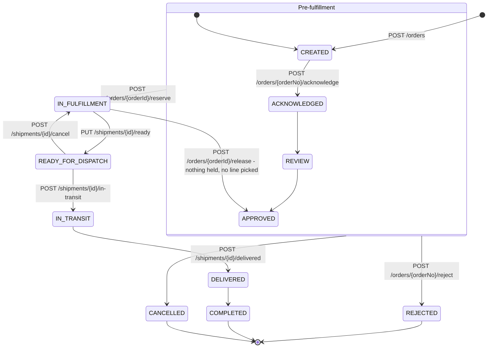
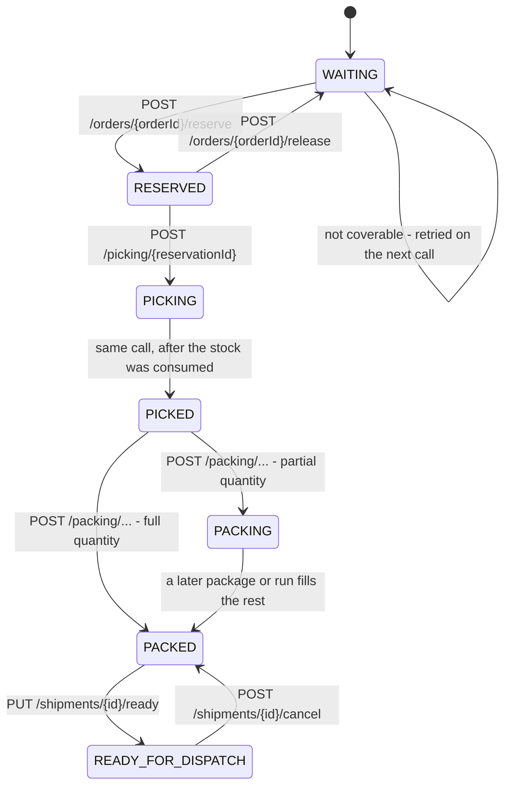
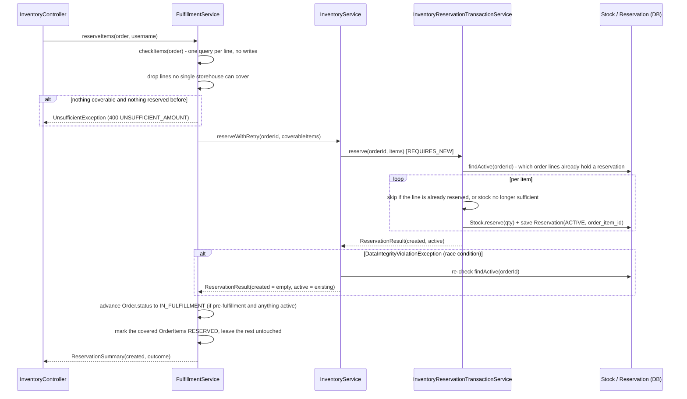
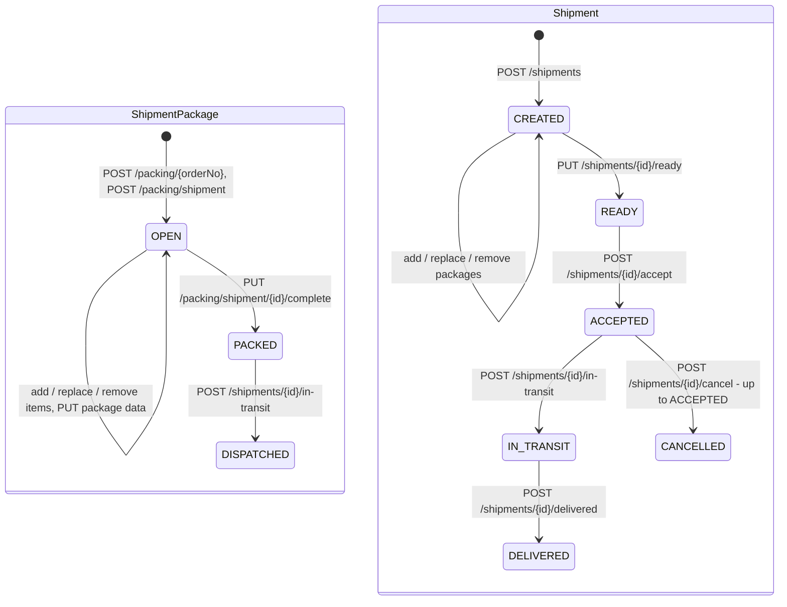
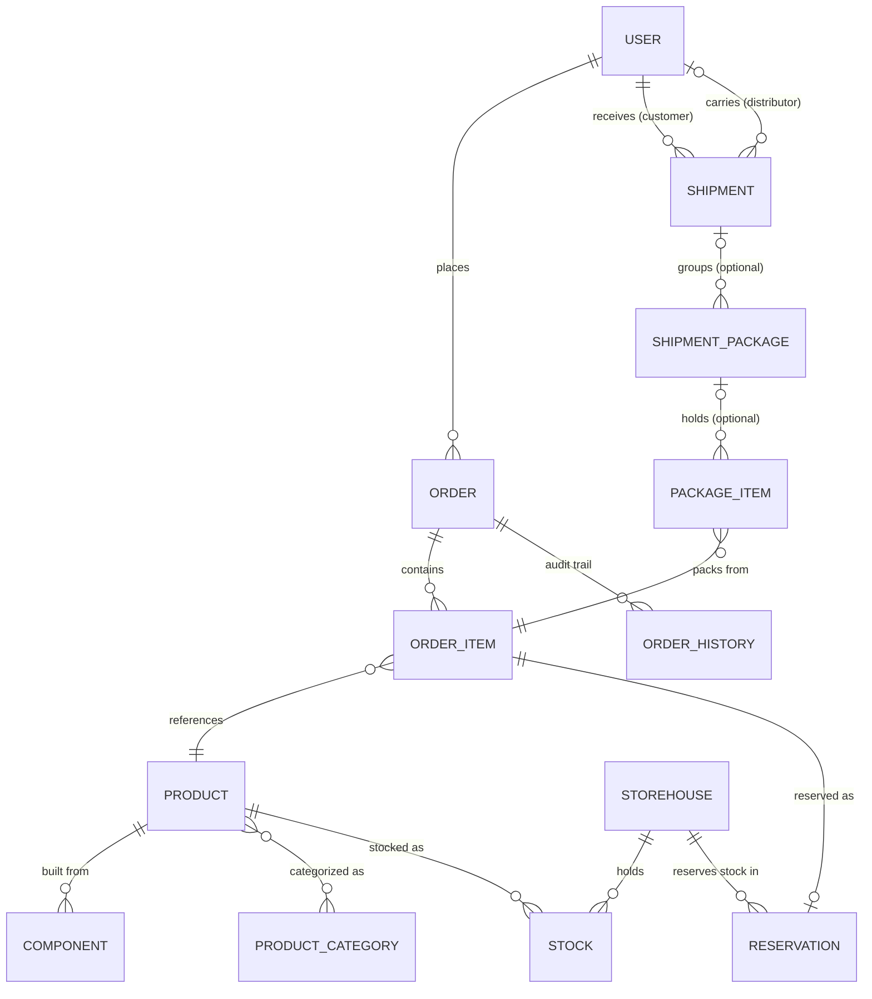

# Supply Chain Management (scm-temporal)

A Spring Boot demo application modeling a simplified supply-chain process: customers place orders,
orders are checked against warehouse stock, inventory is reserved, and the reserved goods are then
picked and packed. Closed packages are grouped into shipments for one customer and handed to a
distributor. It exposes a versioned JSON REST API secured with JWT, plus a classic server-rendered
Thymeleaf site.

> This document covers the **backend/REST API**. The project also ships a Vaadin-based admin UI
> (`src/main/java/com/supplychainmanagement/vaadin`) and a React frontend (`src/main/frontend`),
> both intentionally left out of this document for now.

## Table of contents

- [Order workflow](#order-workflow)
- [Fulfillment workflow](#fulfillment-workflow)
- [Packages and shipments](#packages-and-shipments)
- [Tech stack](#tech-stack)
- [Getting started](#getting-started)
- [Configuration](#configuration)
- [Architecture](#architecture)
- [Domain model](#domain-model)
- [REST API overview](#rest-api-overview)
- [Authentication & authorization](#authentication--authorization)
- [Rate limiting](#rate-limiting)
- [Testing](#testing)
- [Known gaps / work in progress](#known-gaps--work-in-progress)

## Order workflow

Every `Order` moves through a coarse-grained `OrderStatus` state machine. The diagram reflects what
is actually implemented today — including which HTTP calls trigger which transition:



Notes on how this actually behaves in the code (`OrderController`, `InventoryController`,
`FulfillmentServiceImpl`):

- **`CREATED`** is the default status set by `Order`'s `@PrePersist` hook when an order is created.
- **`ACKNOWLEDGED`** is set by `POST /orders/{orderNo}/acknowledge` and only from `CREATED`. The
  call also confirms a **delivery date**: `OrderServiceImpl.acknowledge` asks
  `ProductionService.checkItems` whether every line is covered by stock today and adds the matching
  lead time in working days (`app.order.leadDays.inStock`, default 2, vs.
  `app.order.leadDays.replenishment`, default 10), skipping weekends. A `dueDate` the customer asked
  for *later* than that wins; an earlier one does not, because the promise has to be keepable.
  Acknowledging is the commercial acceptance of an incoming order — the equivalent of an EDIFACT
  `ORDRSP` / X12 `855` — so it is a deliberate act by ADMIN or MANAGER, the counterpart to
  `/reject`. It used to happen as a side effect of `GET /orders/{orderNo}`, which made a read change
  state and let anyone opening the detail view, warehouse staff included, commit the company to the
  order.
- **`REVIEW`** and **`APPROVED`** are modeled in the enum but not yet driven by any endpoint.
- **`REJECTED`** can be set from any pre-fulfillment status via `POST /orders/{orderNo}/reject`
  (the only check is that the order isn't already rejected — a repeat is a **400**). It is
  `OrderService.reject()`, not a status the controller sets: an entity changed before a service
  reloads it looks unchanged to that service, which cost this transition its audit row until
  2026-09-23. See [Timestamps and audit](#order-status-flow) — the rule is that no caller writes
  `order.setStatus(...)` itself.
- **`IN_FULFILLMENT`** is set by `FulfillmentServiceImpl.reserveItems()` — but **only** when the
  order is currently in one of `CREATED`, `ACKNOWLEDGED`, `REVIEW`, or `APPROVED`
  (`PRE_FULFILLMENT_STATUSES`) **and** at least one line is covered by an active reservation. This
  makes the reserve call idempotent: calling it again on an order that already advanced past this
  point does not regress its status. A *partial* reservation counts — fulfillment has started for at
  least one line.
- **Back to `APPROVED`** is the one backwards transition: `releaseItems` returns an order to
  `APPROVED` once the release leaves it holding no reservation at all — the mirror image of the
  `IN_FULFILLMENT` step. It does **not** when any line is already past `RESERVED`: a picked line
  holds only a `CONSUMED` reservation, which does not count as active, but its stock has left the
  shelf. A partial release leaves the status alone. Like every other transition it publishes an
  event, and it does so even when the acting user cannot be resolved (a scheduled sweep runs as
  `"system"`), writing the audit row with a null `user_id`.
- **`READY_FOR_DISPATCH` → `IN_TRANSIT` → `DELIVERED`** come from the shipment the order's packages
  travel in, see [Packages and shipments](#packages-and-shipments). A cancelled shipment takes its
  orders back to `IN_FULFILLMENT` — the second backwards step besides the fallback to `APPROVED`, and
  only while no line of that order travels in another shipment. **`COMPLETED`** and **`CANCELLED`**
  are defined in `OrderStatus` but nothing sets them — see
  [Known gaps](#known-gaps--work-in-progress).
- **Every status change goes through `OrderProgressService.changeStatus()`** — it writes the status,
  saves and publishes the `OrderStatusChangedEvent` in one place. `OrderServiceImpl` (create, update,
  and with them acknowledge and reject), `FulfillmentServiceImpl` (`IN_FULFILLMENT`, back to
  `APPROVED`) and the shipment side all call it; `advance()` and `takeBackFromDispatch()` are the
  variants with a direction rule, `recordCreated()` the first row of a new order.
  `OrderStatusChangedListener` picks the event up `AFTER_COMMIT` and writes an immutable
  `OrderHistory` row (previous status, new status, acting user). Do not write `order.setStatus(...)`
  and publish by hand: every caller that did had its own idea of what to do when the acting user
  could not be resolved, and one of them then wrote the status without an audit row at all. A `null`
  target and one the order already has are ignored, so a CRUD update that sends no status leaves the
  order where it is instead of nulling it.
- Two things are load-bearing for that audit trail and easy to break again:
  - The publishing method **must** be `@Transactional`. `@TransactionalEventListener(AFTER_COMMIT)`
    silently discards events published without a transaction — no error, no log line.
  - The listener **must** be `@Transactional(propagation = REQUIRES_NEW)`. An `AFTER_COMMIT`
    callback runs while the original transaction's resources are still bound but the transaction is
    already committed; with the default propagation the repository call joins that finished
    transaction and its `EntityManager` is closed without another flush, so the row is dropped.

## Fulfillment workflow

Independently of the order-level status, each **`OrderItem`** tracks its own, finer-grained
`FulfillmentStatus`. It is implemented end to end:



Which service owns which stretch — one controller per service, named after what it does:

| Stretch | Service | Controller |
|---------|---------|------------|
| availability check, production | `ProductionService` | `ProductionController` |
| `WAITING ⇄ RESERVED` | `FulfillmentService` | `InventoryController` |
| `RESERVED → PICKED` | `OrderHandlingService` | `PickingController` |
| `PICKED → PACKED`, package contents, completing a package | `PackingService` | `PackingController` (`/packing/**`, plus `/order-items`) |
| reading packages and package items | `PackageQueryService` | `PackageController` |
| packages → shipment, ready, cancel | `ShipmentService` | `ShipmentController` (`/shipments/**`) |
| accept → in transit → delivered | `DeliveryService` | `ShipmentController` (same paths, DISTRIBUTOR) |
| every order status change (write + audit event) | `OrderProgressService` | — |
| `PACKED → READY_FOR_DISPATCH` (lines and their orders) | `ShipmentService.checkShipmentReady()` | `ShipmentController` (`PUT /shipments/{id}/ready`) |
| tracking, returns | `DeliveryService` | — (not implemented) |

- **Reservation is partial.** Lines that a single storehouse can cover become `RESERVED`; the rest
  stay `WAITING` and are attempted again on the next reserve call, which skips whatever is already
  held for that order. An order is only rejected outright when *nothing* can be reserved and nothing
  was reserved earlier.
- **Picking is all-or-nothing per line.** `POST /picking/{reservationId}` consumes the reserved
  stock and takes the line `PICKING → PICKED` in one call; there is no partial pick, because the
  quantity was already fixed when the line was reserved. If nothing could be consumed (no stock row,
  no active reservation) the pick is aborted with **400** instead of marking the line `PICKED`.
  `consume` writes `CONSUMED` in its own transaction and `pick` does not write the reservation a
  second time — on MariaDB 11.6+ (`innodb_snapshot_isolation`) that second update fails with
  `Record has changed since last read in table 'reservation'`. Picking a line that is not `RESERVED`
  is rejected with **400**, not silently skipped.
- **The packing work list** is `GET /order-items`: order lines by fulfillment status, `PICKED` by
  default, sorted by `updatedAt`, each with its `reservationId`.
- **Three ways to pack.** `POST /packing/{orderNo}` builds a `ShipmentPackage` together with its
  items; `items` is required and every line has to belong to that order. `POST /packing` creates
  loose `PackageItem`s without a package — every item of one call shares a `runNo`, which is how a
  packing run is found again, and the lines may belong to different orders. `POST /packing/shipment`
  creates a package; `items` may be left out, and items that are sent are validated and packed like
  the others, without being tied to an order number. All three set the package up alike (type
  falling back to `OTHER`, dimensions, generated package number).
- **Packing is quantity-aware**, the same for packages and loose items. Every line is read locked
  and handled in ascending id order, quantities before status:
  1. unknown order item → **404**; a line of another order (`/packing/{orderNo}` only) → **400**
  2. *already packed* counts every package item of the line, in a package or loose, plus what earlier
     entries of the same request hold
  3. line already full → skipped
  4. more than the room left → **400**, never clipped to the rest
  5. status not `PICKED`/`PACKING` → skipped — so `PACKED` and `READY_FOR_DISPATCH` lines are never
     packed again, even without package items
  6. otherwise packed; the line becomes `PACKED` once the ordered quantity is reached, `PACKING` before

  An empty list or a `qty` below 1 is rejected with **400** before any line is locked. When nothing
  at all could be packed, the 400 names every skipped line with its reason, e.g.
  `No valid items to pack for order 1042: OrderItem 11 is RESERVED, only PICKED or PACKING can be packed`.
- **One item per line and run.** Each entry of a request is measured on its own, but what it packs is
  folded into the item of the same line already created in that call: `6 + 4` on a line of 10 becomes
  one item of 10, `5, 5, 5` packs one item of 10 and skips the third entry, `8 + 8` is still a 400.
  Two items of one line from the same run would violate `uq_package_item_order_item_run`.

### Reservation flow in detail

`reserveItems(order, username)` in `FulfillmentServiceImpl` orchestrates three collaborators:



**The response reports only what this call created.** What an earlier call already reserved is left
out — a repeated call is a no-op and has nothing to show for itself. Since an empty array then has
two possible meanings, `ReservationOutcome` distinguishes them and the controller maps it to the
status code:

| Outcome | Status | Meaning |
|---------|--------|---------|
| `CREATED` | **201** | at least one reservation was newly created |
| `COMPLETE` | **200** | nothing new; every line of the order is reserved or further along |
| `PENDING` | **202** | nothing new, but lines are still `WAITING` — worth calling again later |

`ReservationResult` carries `created` **and** `active` for exactly this reason: the response needs
the first, while the order-status and line-status reconciliation needs the second. A repeat call
after a first one that committed its reservation but failed before the order was written has to be
able to catch the order status up, and it creates nothing to go by.

The reservations in the response are `ReservationDto`s: id, orderId (the numeric `Order.id`),
orderItemId, sku, quantity, storehouseId, status and expiry. Related entities appear as ids only, so serializing the response
cannot pull the order line or the storehouse - see [Responses are DTOs](#responses-are-dtos-not-entities).

Two layers guard against creating duplicate reservations for the same order:

1. **Idempotency guard, per order line** — `InventoryReservationTransactionService.reserve()` loads
   the order's active reservations up front and skips every item whose order line already holds one.
   That is what makes a repeated call continue where the previous one stopped rather than start
   over, and it also covers the case where `checkItems()` picks a different storehouse the second
   time around. Keyed by line rather than by SKU - the two coincide, since an order carries every
   article at most once (`uk_order_item_order_product`), but the line is what a reservation belongs
   to.
2. **Race-condition fallback** — the DB unique constraint on `order_item_id` is the last line of
   defense; `InventoryServiceImpl.reserveWithRetry()` catches
   `DataIntegrityViolationException` and returns the now-existing reservations as `active` with an
   empty `created` — the concurrent call did the inserting, not this one.

An item that cannot be reserved is **skipped, not thrown on** — a single unavailable line must not
roll back the lines that succeeded. `Stock.reserve()` validates before it mutates, so checking
availability up front leaves no half-changed entity behind.

`reserveItems()` and `releaseItems()` are `@Transactional`, so the order status, the line item
statuses and the published event share one commit. The stock side does **not** roll back with them:
`reserve()`/`release()` run `REQUIRES_NEW` and commit on their own. That is deliberate — the
idempotency guard and the retry loop need to see committed state — but it means a failure after the
reservation leaves stock reserved while the order stays untouched. The idempotency guard makes a
repeat call safe.

Releasing (`releaseItems()` / `InventoryReservationTransactionService.release()`) frees the reserved
stock and **deletes** the `Reservation` row (rather than just flipping it to `RELEASED`) — the
unique constraint above would otherwise permanently block re-reserving the same order line.

### Scheduled routines

`AutomaticReservationService` (`service/business`) holds what runs without a request.
`@EnableScheduling` is switched on by `AutomaticProductionService`, so a `@Scheduled` on a bean is
enough. During development the `@Scheduled` annotations of these four are commented out; the
intervals are the ones they carry:

| Routine | Does | Interval |
|---------|------|----------|
| `checkCreatedOrders()` | checks coverage per `CREATED` order and acknowledges the ones whose every line is coverable | every 300 s |
| `tryToReserve()` | calls `reserveItems` for every order in `IN_FULFILLMENT` | every 150 s |
| `tryToRelease()` | calls `releaseItems` for every order holding a reservation past `expiresAt` (`findOrdersWithExpiredReservations()`) — **all** of that order's active reservations | every 150 s |
| `tryToDelete()` | deletes the `CONSUMED` reservations of `READY_FOR_DISPATCH` orders two days after `expiresAt` — finds nothing today, no order reaches that status | every 150 s |

All four change state; each works the first 100 orders of its status. `checkItems` itself still
writes nothing — it is the `acknowledge` call after it that does.

`AutomaticProductionService.assemble()` is active: every 150 s it runs `produce()`, which builds
products from component stock.

`FulfillmentService.findOrdersWithExpiredReservations()` returns every order that holds at least one
expired, still active reservation, each order once. `expiresAt` only decides *which* orders the sweep
picks: the release itself is per order, so `releaseItems` hands back all of that order's active
reservations, including ones reserved later that have not run out yet. A full release takes the
order back to `APPROVED`, and `tryToReserve()` only looks at `IN_FULFILLMENT`.

There is no open-in-view session out here, so every order these routines work on has to arrive with
its `orderItems` already fetched — otherwise it turns into a `LazyInitializationException`.
`checkCreatedOrders()` and `tryToReserve()` get theirs from `findAllByStatus`,
`findOrdersWithExpiredReservations()` loads them in a single query through
`OrderRepository.findWithOrderItemsByIdIn`, both via `@EntityGraph`. For the release this matters
more than elsewhere: `releaseItems` walks `orderItems` only after the stock has already been released
in its own `REQUIRES_NEW` transaction, so a lazy failure there would leave the lines on `RESERVED`
over reservations that are already gone.

## Packages and shipments

Packing produces `ShipmentPackage`s holding `PackageItem`s; closed packages of one customer are then
grouped into a `Shipment`. Both levels follow the same pattern: the child owns the foreign key, it
outlives its parent (taken out, it is free again — never deleted), and only the parent's methods
change the relation.



### Changing what a package holds

Only an **`OPEN`** package can change (otherwise **409**). Items move between *loose* and *in a
package* — there is no quantity check and no status change on the order line, the items were counted
as packed when they were created.

| Endpoint | Does |
|----------|------|
| `POST /packing/shipment/{id}/items` | puts loose items into the package; items already in it stay, so a repeat changes nothing |
| `PUT /packing/shipment/{id}/items` | makes the package hold exactly these items; the others become loose, `[]` empties it |
| `DELETE /packing/shipment/{id}/items/{itemId}` | takes one item out; it becomes loose |
| `PUT /packing/shipment/{id}` | the package's own data: type, dimensions, package number |

The id lists accept both `{"packageItemIds": [101, 102]}` and the bare array `[101, 102]`. An item
already in another package is a **409** (never moved silently), a package holds the items of one
order only (**400**), and at most one item per order line **and run** (**409**) — the key of
`uq_package_item_order_item_run (shipment_package_id, order_item_id, run_no)`, so one line packed in
two runs may share a package.

### Completing a package

`PUT /packing/shipment/{id}/complete` takes a package from `OPEN` to `PACKED` and stamps `packedAt`;
from then on its contents are fixed and it can go into a shipment. A package without items is
refused with **400** — it would go to no customer and could not be filled any more. Not `OPEN` is a
**409**.

### Package weight

A package's `weight` is **computed, never sent** — no request carries a weight. It is the weight of
the contents (product weight × packed quantity, 0 without items), kept current by the package itself:
on insert, and through `addItem`/`removeItem` whenever the contents change. `packageWeight` adds the
tare of the `ShipmentPackageType` (a Euro pallet brings 25 kg of its own, a pallet cage 70). Do not add
a `getWeight()` of your own to `ShipmentPackage`: a hand-written getter suppresses Lombok's.

### Shipments

A shipment groups **`PACKED`** packages for **one customer** and is never empty:

```json
POST /api/1.0/shipments
{
  "customerId": 3,
  "shipmentPackageIds": [5, 7],
  "shippingAddress": "Musterstr. 1, 12345 Berlin",
  "shippingMethod": "DHL",
  "requestedDeliveryDate": "2026-10-01"
}
```

| Rule | Answer |
|------|--------|
| `customerId`, at least one package, `shippingAddress` missing | **400** |
| customer unknown / not a `Customer` | **404** / **400** |
| a package id unknown | **404**, naming every missing id |
| package not `PACKED` | **409** |
| package already in another shipment | **409** |
| package empty, or holding items of another customer's order | **400** |
| two packages with the same package number | **409** (`uk_shipment_package_number` would otherwise fail the flush) |
| emptying the shipment (`PUT .../packages []`, removing the last package) | **400** |
| shipment no longer `CREATED` | **409** |

Packages are added, replaced and removed through `POST`/`PUT /shipments/{id}/packages` (wrapped or
bare array) and `DELETE /shipments/{id}/packages/{packageId}`; `PUT /shipments/{id}` changes address,
method and requested date. The customer is fixed — the packages are bound to it.

A distributor is assigned with `PUT /shipments/{id}/distributor/{distributorId}` while the shipment is
`READY` or `DISPATCH_REQUESTED`; the user has to be a `Distributor` (**400** otherwise).

### From ready to delivered

```
PUT  /shipments/{id}/ready        CREATED → READY          lines + orders → READY_FOR_DISPATCH
POST /shipments/{id}/accept       READY → ACCEPTED         (orders already there)
POST /shipments/{id}/in-transit   ACCEPTED → IN_TRANSIT    packages → DISPATCHED, orders → IN_TRANSIT
POST /shipments/{id}/delivered    IN_TRANSIT → DELIVERED   orders → DELIVERED
POST /shipments/{id}/cancel       up to ACCEPTED → CANCELLED
```

**Ready** is checked, not claimed: the shipment is read `FOR UPDATE`, has to be `CREATED`, carry a
shipping address and at least one package, and every package has to be `PACKED` — each of them a
**409**. Only then do the order lines it carries go from `PACKED` to `READY_FOR_DISPATCH`, and the
orders behind them with them; a line still `PACKING` has parts in another package and is left alone.
The order moves here rather than at `accept`, because `READY_FOR_DISPATCH` is the warehouse reporting
it ready *for* the distributor, not the distributor answering. `accept` still asks for the same step,
which then catches up an order that was not moved here and does nothing for the rest.

**The three carrier steps** (ADMIN and DISTRIBUTOR) live in `DeliveryService`, not in
`ShipmentService`: planning a shipment is the inside job of `RoleEnum.LOGISTICS`, reporting it is the
carrier's. They answer with `DeliveryResponse` — address, package count, weight and package numbers,
but **no package contents**, so a distributor never sees the customer's SKUs and quantities. They
take the orders of the shipment along —
`IN_TRANSIT`, `DELIVERED`, and `READY_FOR_DISPATCH` as a catch-up — found over the packages, since a shipment may carry
packages of several orders of its customer. Orders move **forwards only**: one that is already
further along, because another shipment reported earlier, and one in `REJECTED`/`CANCELLED` are left
as they are. Every change publishes an `OrderStatusChangedEvent`, so the `OrderHistory` row is
written like for any other transition.

**Cancelling** (ADMIN and LOGISTICS) works up to `ACCEPTED` — once the goods roll it would be a
return, which the process does not model — and needs a reason, which is kept in `comment`. It undoes
what the shipment had set in motion: the packages are loose again and stay `PACKED`, lines go back
from `READY_FOR_DISPATCH` to `PACKED`, and orders back to `IN_FULFILLMENT` unless a line of theirs
travels in another shipment.

**What may still change, by status:**

| | `CREATED` | `READY` … `ACCEPTED` | from `IN_TRANSIT` |
|---|---|---|---|
| packages in/out | yes | **409** | **409** |
| address, method, date, comment | yes | yes | **409** |
| cancel | yes | yes (up to `ACCEPTED`) | **409** |

`ShipmentResponse` carries the shipment's data, customer and distributor as id and name, the gross
`weight` of all packages and the packages with their contents. The list (`GET /shipments`, optional
`status`) answers `ShipmentListDto` rows with the package ids only.

## Tech stack

| Layer          | Technology                                                                  |
|----------------|-----------------------------------------------------------------------------|
| Language       | Java 25                                                                     |
| Framework      | Spring Boot 4.1.0 (Web MVC), Spring Security 7                              |
| Persistence    | Spring Data JPA / Hibernate ORM 7, MariaDB (`hibernate-community-dialects`) |
| JSON           | Jackson 3 (`tools.jackson`) — see the note below                            |
| Auth           | JWT (`jjwt`), BCrypt/Argon2 via BouncyCastle                                 |
| Mapping        | MapStruct, Lombok                                                           |
| Rate limiting  | Bucket4j                                                                    |
| Testing        | JUnit 5, Mockito, AssertJ, standalone MockMvc                               |
| Build          | Maven (wrapper included: `mvnw` / `mvnw.cmd`)                               |

> **Jackson 2 and 3 coexist here.** Spring Boot 4.1 auto-configures **Jackson 3**
> (`tools.jackson.databind`), and that is what serializes the API responses — inject
> `tools.jackson.databind.ObjectMapper`, there is no bean for the Jackson 2 one. Jackson 2
> (`com.fasterxml.jackson.databind`) stays on the classpath because `jjwt-jackson` needs it; do not
> remove that dependency. The **annotations** did not move: `@JsonInclude`, `@JsonFormat`,
> `@JsonIgnore`, `@JsonCreator` are still `com.fasterxml.jackson.annotation.*` and are honoured by
> Jackson 3.

`spring-boot-starter-webflux` is still a declared dependency but no longer used by any code — see
[Synchronous by design](#synchronous-by-design).

## Getting started

### Prerequisites

- JDK 25
- A MariaDB instance reachable per `spring.datasource.url` (default: `jdbc:mariadb://h3:3306/scm`)
- Maven (or use the bundled `./mvnw` / `mvnw.cmd` wrapper)

### Build

```bash
mvn -q compile
```

### Run (dev profile)

```bash
mvn -Dspring-boot.run.profiles=dev spring-boot:run
```

The app starts on `server.port` (default `8080`). Logs are written both to stdout and to
`logs/app-<port>.log` (`logging.file.name=logs/app-${server.port}.log` in
`application-dev.properties`) — tail that file to tell `Started Application` from
`APPLICATION FAILED TO START`.

### Run tests

```bash
mvn test
```

## Configuration

Configuration is split across Spring profiles:

- `application.properties` — shared defaults: datasource URL/credentials, JPA dialect
  (`ddl-auto=update`), API versioning defaults, Vaadin URL mapping.
- `application-dev.properties` — dev-only overrides: DevTools hot-reload, JWT secret/expiration,
  file logging.
- `application-prod.properties` — production overrides.
- `application.properties.dist` — a template to copy from for local/untracked overrides.

> The three live `application*.properties` files are **git-ignored**: they hold the datasource
> credentials and `app.jwtSecret`. Start from `application.properties.dist` - it carries a working
> default for every placeholder the code requires without one (`app.jwtSecret`,
> `app.jwtExpirationMs`, `app.cookie.name`, `app.cookie.secure`, `app.mysqldatafile`); only the
> datasource has to be filled in. A missing one fails the context start with
> `Could not resolve placeholder ...`, naming the property.
>
> Watch where a property lives. Anything defined only in `application-dev.properties` is invisible
> to a run without an active profile - `@SpringBootTest` being the one that bites, since it loads
> `application.properties` alone. Properties both profiles override still belong there as well.

> **Persistence caveat:** `spring.jpa.hibernate.ddl-auto=update` will add missing tables/columns but
> will **not** fix an existing column's type, backfill data, or add/drop constraints. If you change
> an entity's `@Enumerated` mapping or a column's type, the database will silently drift out of sync
> with the entity unless you migrate it manually (verify with `information_schema` /
> `SHOW CREATE TABLE`, don't assume the entity mapping matches what's actually in the DB).
>
> The `reservation.order_item_id` column is the classic example: `update` adds the column and then
> fails to add its foreign key, because existing rows carry a value that references nothing. Adding
> a `NOT NULL` column to a populated table leaves MariaDB's default (`0`) behind, and `0` is not a
> valid `order_items.id`. Such a column has to be added nullable, backfilled, and only then
> constrained.
>
> The reverse needs a manual step as well: `package_item.shipment_package_id` became optional for
> loose items, but `update` keeps the existing `NOT NULL` - run
> `ALTER TABLE package_item MODIFY shipment_package_id BIGINT NULL`. Data migrations that cannot
> wait for a migration tool run on startup from `config` (`OrderDateToCreatedMigration` moved
> `orders.order_date` into `created` and dropped the column); they are guarded to do nothing once
> done, and `@SpringBootTest` runs them too, against the same database.

## Architecture

### Two request pipelines, one JWT filter

`SpringSecurityConfig` defines three independently-ordered `SecurityFilterChain` beans, scoped with
`.securityMatcher(...)` so their rules never interact:

1. **`apiFilterChain`** (`/api/**`) — stateless, JWT-authenticated (`JwtAuthenticationFilter` +
   `JwtTokenProvider` + `JwtAuthenticationEntryPoint`), CSRF disabled.
2. **`vaadinFilterChain`** (`/app/**`) — Vaadin's own security configurer (out of scope here).
3. **`webFilterChain`** (everything else) — classic Thymeleaf pages, session-based form login,
   CSRF stays on.

### Native Spring MVC API versioning

Endpoints declare a version directly on the mapping annotation, e.g.
`@GetMapping(path = "/{orderNo}", version = "1.0")` (see `OrderController`, `AuthApiController`'s
two `/login` variants for `1.0`/`2.0`). `WebConfig` configures a custom `useVersionResolver` that
reads the version from the second path segment (`/api/1.0/...` → `"1.0"`). `ApiVersionDefaultFilter`
runs at the highest filter precedence and rewrites any unversioned `/api/...` request to
`/api/{spring.mvc.apiversion.default}/...` (default `1.0`) *before* Spring MVC or Security see it —
so clients may omit the version and still hit versioned endpoints. When adding a new endpoint,
follow the existing pattern: class-level `@RequestMapping({"/api/{version}/..."})`, per-method
`version = "x.y"`.

### Paged list endpoints

Every list endpoint follows the same shape, established by `OrderController.list`: four request
parameters `page` / `size` / `sort` / `order`, assembled into a `PageRequest`, and answered with
`PageResponse.of(page)`:

```json
{ "content": [ ... ], "total": 42, "page": 0, "size": 25 }
```

`total` carries the overall count the frontend dataProvider needs for pagination. Defaults are
`page=0`, `size=25`, `order=ASC`; the default `sort` field differs per endpoint (`id` for orders,
packages and shipments, `expiresAt` for the picking list, `updatedAt` for order lines, `sku` for
stock).

Note that `sort` is applied as a JPQL path, so only fields resolvable under the query's root alias
work. On a projection query a sort over a joined column (`productName` → `p.name`) will fail.

Lists whose rows carry a collection — packages with their items, shipments with their packages —
are two queries: the page itself, then the rows of that page with the collection fetched. A
collection fetch in the page query would make Hibernate page in memory.

### Responses are DTOs, not entities

List and detail endpoints answer with records under `dto/`, never with JPA entities. This is not
cosmetic — handing an entity to the response writer breaks in several ways at once:

- **N+1 queries.** `spring.jpa.open-in-view` is left at its default (`true`), so the session is
  still open while the response is written and every LAZY reference resolves silently, one query per
  row and per level.
- **Cycles.** `Reservation → orderItem → order → orderItems → orderItem …` closes on itself, and so
  does `ShipmentPackage → items → shipmentPackage`; Jackson cannot get out of it.
- **Closed sessions.** Whatever comes back from a `REQUIRES_NEW` transaction — the whole inventory
  layer — was loaded by a session that has already closed. Its LAZY references cannot be resolved
  any more, and serializing it fails with `Could not initialize proxy … - no session`; open-in-view
  does not help, its session is a different one. Both reserve and release answer with
  `ReservationDto`, which carries related entities as ids only — Hibernate serves `getId()` on a
  proxy without initializing it.
- **Leaks.** A `User` entity carries the password hash and the roles. Customer and distributor
  appear in responses as id and name only.

The same holds for **request bodies**: a controller binds a record under `dto/`, never an entity —
bound from JSON, an entity accepts every field it has. `UserController` used to take `User` and with
it `id`, `userType` and full `Role` objects; it now takes `UserRequestDto`, roles as names
(`["MANAGER"]`, case-insensitive).

The picking list is the reference example: `PickingOrderDto` is filled by a constructor projection
in `ReservationRepository.findPickingOrders()`, which is **one query** for the page regardless of
its size, with nothing lazy left in the response. The picking *actions* return the same DTO, mapped
inside `OrderHandlingServiceImpl` while the session is open, so the warehouse gets one row format
everywhere.

A projection query needs an explicit `countQuery` when it joins: the joins are inner joins and can
drop rows, so a plain `count(r)` would report a larger total than the page query can deliver.

`GET /order-items` follows the same pattern with `OrderItemListDto`, and adds the line's
`reservationId` through `left join Reservation r on r.orderItem = oi`: an entity join with `ON`,
because `OrderItem` has no reference to its reservation, and a left one, because a `WAITING` line has
none — `reservationId` is `null` then.

A package item is answered as `PackageItemResponse` (`id`, `createdAt`, `orderItemId`, `orderNo`,
`sku`, `quantity`, `totalQuantity`, `siblings`, `runNo`, `shipmentPackageId`, `fulfillmentStatus`).
`siblings` — the ids of the other package items of the same order line — is computed, not stored:
`PackageItemResponseAssembler` looks it up for all items of a response in one query. Inside a
package row the items are `ShipmentPackageItemDto` (no package id — the row is the package).

### Error responses

Two shapes are in use. `PickingController` and `PackingController` catch `APIException` themselves
and answer `{"message": "..."}` at the exception's status. Everything else — a
`ResourceNotFoundException` there too, and all of `PackageController`, `ShipmentController` and
`UserController` — goes through `GlobalExceptionHandler` and answers `ErrorDetails` with an
`errorCode`; a failed bean validation comes back as **400** with one message per field, e.g.
`{"items[0].qty": "qty must be at least 1"}`. New endpoints use the global handler; the
controller-local try/catch is legacy.

### Synchronous by design

All service interfaces are plain synchronous methods. `OrderService`, `ProductService`,
`ComponentService` and `UserService` used to return `Mono`/`Flux` over blocking JPA, wrapped in
`Mono.fromCallable(...).subscribeOn(Schedulers.boundedElastic())`. That combination made
`@Transactional` **ineffective**: the transaction proxy commits when the method returns, and such a
method returns the not-yet-executed `Mono` immediately — the actual database work then ran later, on
a different thread, outside any transaction. Nothing was atomic, `readOnly` had no effect, and
`@TransactionalEventListener(AFTER_COMMIT)` never fired because there was no transaction to commit.

Do not reintroduce reactive return types over JPA here. If a service needs to be async, the
transaction has to live *inside* the callable, on a separate bean — self-invocation goes around the
proxy and changes nothing. `InventoryServiceImpl` → `InventoryReservationTransactionService` is the
existing example of that pattern.

Only commented-out code still mentions `Mono` (`OrderController`, `ComponentController`).

### Service boundaries

The fulfillment chain is split by responsibility rather than by entity, one controller per service:

- **`ProductionService`** — `checkItems()` (read-only availability per line) and `produce()`
  (builds finished products from component stock: picks a storehouse that holds enough of every
  required component, decrements them, and adds the produced unit as new stock). `POST /produce`
  answers the page plus `produced`, the number of products actually built.
- **`FulfillmentService`** — getting an order reserved: `reserveItems()` / `releaseItems()`.
- **`OrderHandlingService`** — what the warehouse does with an order that is already reserved:
  the picking list, the order lines by fulfillment status, picking by reservation or by order, and
  the final `readyForDispatch()`.
- **`PackingService`** — packing picked lines into a `ShipmentPackage` or as loose items of a run,
  changing what a package holds, completing it.
- **`PackageQueryService`** — reading packages and package items.
- **`ShipmentService`** — creating and changing shipments, assigning a distributor, reading them.
- **`DeliveryService`** — the carrier's side: accept, in transit, delivered. Answers with
  `DeliveryResponse`, without the package contents.
- **`OrderProgressService`** — the one place an order status is written: `changeStatus()` for a
  single step, `advance()` forwards only on behalf of a shipment, `takeBackFromDispatch()` for the
  way back from a cancelled dispatch, `recordCreated()` for a new order. Publishes the status event
  and runs `Propagation.MANDATORY`, so it cannot be called outside the caller's transaction.

### Timestamps

Creation and update times are maintained by Hibernate: `@CreationTimestamp` / `@UpdateTimestamp` on
the field, set on flush. Do not write them by hand — a manual assignment is overwritten and only
reads like it does something. Spring Data's `@CreatedDate` / `@LastModifiedDate` are **not** an
alternative here: they need `@EntityListeners(AuditingEntityListener.class)` and `@EnableJpaAuditing`,
neither of which is configured, so the fields would stay `null` — and `NOT NULL` columns such as
`order_history.changed_at` would fail the insert.

### AOP utilities

**`@NoCheck`** (`annotation/NoCheck.java`) + `NoCheckAspect` — a marker annotation currently only
used for `@After` logging via AspectJ; it does not (yet) affect authorization or validation.

## Domain model

Simplified entity relationships:



- **`User`** (`entity/users`) is a single-table-inheritance hierarchy (`Admin`, `Customer`,
  `Distributor`, `Logistics`, `Manager`, `Supplier`, `Warehouse`) discriminated by `user_type`, with
  a many-to-many `Role` relationship (`RoleEnum`: `CUSTOMER`, `MANAGER`, `SUPPLIER`, `WAREHOUSE`,
  `LOGISTICS`, `DISTRIBUTOR`, `ADMIN`).
- **An article appears on one line only.** `order_items` carries a unique constraint over
  `(order_id, product_id)`. A request repeating an article is not rejected but **folded**:
  `OrderServiceImpl.mergeDuplicateProducts` keeps the first line and adds the repeated quantities to
  it, so three plus two become one line of five. The rule matters beyond tidiness — `(order,
  product)` identifies the line a reservation belongs to. After the merge each line is held against
  `MAX_LINE_QUANTITY` (20): two lines of 11 become 22 and are refused with **400**.
- **`Order.orderItems`** is a `Set` ordered by `@OrderBy("id")`. It is a Set rather than a List
  because the `@EntityGraph` on `OrderRepository` fetches three collections at once — with two
  `List`s among them Hibernate raises `MultipleBagFetchException`. `Product.components` is the only
  bag left in that graph; adding a second one brings the exception back. The `@OrderBy` is what
  keeps the line items in a stable order, since a Set mapping is otherwise loaded into a
  HashSet-backed collection with arbitrary iteration order.
- **`Product`** has a unique `sku` (`UUID`) and `articleNo` (`Long`), belongs to zero or more
  `ProductCategory`, and is built from `Component`s. Its weight is computed from the component
  weights on persist; without components (or components without a weight) it is 0 rather than a
  failed insert.
- **`Stock`** tracks `onHand`/`reserved` quantity per `(storehouse, sku)` pair (unique constraint),
  with optimistic locking (`@Version`) and domain methods `reserve()`/`release()`/`consume()` that
  enforce non-negative availability. `available` is derived as `onHand - reserved`.
- **`Reservation`** points at the `OrderItem` it was made for, through a unidirectional, LAZY
  `@OneToOne` on `order_item_id`. It has no order id of its own: the order is the line's
  (`orderItem.order`), and the reservations of an order are found through the line. `sku` and
  `quantity` are kept denormalized: `Stock` is keyed by `(sku, storehouse)`, so the hot
  reserve/release path reaches its data without joining through the order item. A unique
  constraint on `order_item_id` - one line, at most one reservation - and a status of
  `ACTIVE` / `RELEASED` / `CONSUMED`; released reservations are deleted rather than kept (see
  [Reservation flow](#reservation-flow-in-detail)).
  - The relation is deliberately **unidirectional** — `OrderItem` does not point back. A back
    reference would drag `Order → orderItems → reservation → orderItem` into every response that
    serializes a reservation.
- **`ShipmentPackage` / `PackageItem`** — a package (`ShipmentPackageType`, dimensions, computed
  weight, `ShipmentPackageStatus`) holds `PackageItem`s that reference an `OrderItem` with a packed
  quantity (at least 1) and the `runNo` of the call that created them. A `PackageItem` may exist
  without a package — loose items from `POST /packing`. `ShipmentPackage.items` has neither
  `orphanRemoval` nor a `REMOVE` cascade: deleting an item would drop the packed quantity while the
  line still reads `PACKING`/`PACKED`.
- **`Shipment`** belongs to a `Customer`, optionally has a `Distributor`, and groups packages;
  `ShipmentPackage.shipment` owns the foreign key, `Shipment.packages` has no cascade and no
  orphanRemoval. See [Packages and shipments](#packages-and-shipments).
- **`OrderHistory`** is an append-only audit trail written by `OrderStatusChangedListener`. Its
  `user_id` is **nullable**: not every status change has an acting user (`reserveItems()` resolves
  one from the login identifier, but `OrderServiceImpl.update(id, order)` has none). A `NOT NULL`
  column here costs the audit row rather than gaining the attribution.

## REST API overview

All endpoints are under `/api/{version}/...` (version can be omitted; see
[versioning](#native-spring-mvc-api-versioning)). Authorization is enforced with
`@PreAuthorize("hasAnyAuthority(...)")` using `RoleEnum` values.

| Resource | Endpoints | Roles |
|----------|-----------|-------|
| Auth | `POST /auth/register`, `POST /auth/login` (`1.0` and `2.0`), `GET /auth/logout` | public |
| Orders | `GET /orders` *(paged)*, `GET /orders/new` *(paged, by status)*, `GET /orders/{orderNo}`, `POST /orders`, `POST /orders/{orderNo}/acknowledge`, `POST /orders/{orderNo}/reject` | ADMIN, MANAGER, CUSTOMER; `/new`, `/acknowledge` and `/reject` ADMIN and MANAGER only, `GET /{orderNo}` additionally WAREHOUSE |
| Production | `POST /orders/{orderNo}/check` (availability — read-only) | ADMIN, MANAGER |
| | `POST /produce` *(paged, plus `produced`)* | ADMIN, MANAGER, WAREHOUSE |
| Inventory | `POST /orders/{orderId}/reserve`, `POST /orders/{orderId}/release` | ADMIN, MANAGER |
| Picking | `GET /picking-orders` *(paged)*, `POST /picking/{reservationId}`, `POST /picking/order/{orderNo}` | ADMIN, WAREHOUSE |
| Packing | `GET /order-items` *(paged, by fulfillment status, default `PICKED`)*, `POST /packing/{orderNo}` (`items[]` required), `POST /packing` (`{"items": [...]}` or the bare array - loose items of one run, paged response), `POST /packing/shipment` (`items` optional), `POST`/`PUT /packing/shipment/{id}/items`, `DELETE /packing/shipment/{id}/items/{itemId}`, `PUT /packing/shipment/{id}`, `PUT /packing/shipment/{id}/complete` | ADMIN, WAREHOUSE |
| Packages | `GET /packages` *(paged, all package items - loose ones have no `shipmentPackageId`)*, `GET /packages/{id}`, `GET /lonely-packages` *(paged, only the loose items)* | ADMIN, WAREHOUSE |
| | `GET /shipment-packages` *(paged, by `ShipmentPackageStatus`, default `OPEN`, optional `packageNumber`)* | ADMIN, LOGISTICS |
| | `GET /shipment-packages/{id}` | ADMIN, WAREHOUSE, LOGISTICS |
| Shipments | `POST /shipments`, `POST`/`PUT /shipments/{id}/packages`, `DELETE /shipments/{id}/packages/{packageId}`, `PUT /shipments/{id}`, `PUT /shipments/{id}/distributor/{distributorId}`, `PUT /shipments/{id}/ready`, `POST /shipments/{id}/cancel` (body `{"reason": "..."}`), `GET /shipments` *(paged, optional `status`)*, `GET /shipments/{id}` | ADMIN, LOGISTICS |
| | `POST /shipments/{id}/accept`, `POST /shipments/{id}/in-transit`, `POST /shipments/{id}/delivered` | ADMIN, DISTRIBUTOR |
| Products | `GET /products`, `GET /products/{articleNo}`, `GET /products/sku/{sku}` | ADMIN, MANAGER, CUSTOMER, WAREHOUSE |
| | `POST /products`, `PUT /products/{id}`, `DELETE /products/{id}` | ADMIN, MANAGER |
| Components | `GET /components`, `GET /components/sku/{sku}`, `GET /components/article/{articleNo}`, `POST /components/`, `PUT /components/{id}`, `DELETE /components/{id}` | ADMIN, MANAGER |
| Stock | `POST /stock/add`, `POST /stock/transfer`, `GET /stock/{sku}`, `GET /stock/storehouse/{id}` *(paged)* | ADMIN, WAREHOUSE |
| Users | `GET /users` *(paged)*, `GET /users/{id}`, `POST /users`, `PUT /users/{id}` (body `UserRequestDto`, roles as names), `DELETE /users/{id}` | ADMIN, MANAGER |

Notable response-code conventions:

- `POST /orders/{orderId}/reserve` returns **201 / 200 / 202** as described under
  [Reservation flow](#reservation-flow-in-detail), and **400** with
  `errorCode: UNSUFFICIENT_AMOUNT` if nothing could be reserved at all and nothing was reserved
  earlier. The body always lists only what *this* call created — an empty array on a repeat.
- `POST /orders/{orderId}/release` releases every active reservation of the order and lists what was
  actually released. An order holding nothing answers **200** with an empty array, not 404.
- `POST /orders` and `POST /shipments` return **201 Created**.
- `GET /stock/storehouse/{id}` answers **404** only when the storehouse holds no stock at all;
  a page past the end is an empty page, not an error.
- Picking and packing answer an `APIException` as `{"message": "..."}`, everything else goes
  through `GlobalExceptionHandler` — see [Error responses](#error-responses).
- `GET /products`, `GET /products/{articleNo}` and all `/users` endpoints return DTOs
  (`ProductDto`, `UserDto`), not entities. `/products` hides `id`, `categories` and `components`
  from non-privileged callers; `/users` never exposes the password hash.
- `GET /orders/{orderNo}` is open to `CUSTOMER`, but scoped: `OrderService.findByOrderNoForUser`
  lets a privileged caller (ADMIN/MANAGER/WAREHOUSE) read any order and everyone else only the ones
  they are the customer of, answering **403** otherwise. Same branch as `findAllByUser` uses for the
  list. It answers 403 rather than 404 deliberately — within this application an order number is not
  a secret, and the clearer answer is worth more than hiding the order's existence.
- Authorization failures return **403** with `errorCode: WRONG_ROLE`, missing authentication
  **401** with `errorCode: UNAUTHENTICATED`.

## Authentication & authorization

- Login (`AuthApiController` → `AuthService`) issues a JWT (`JwtTokenProvider`) and sets it as a
  cookie (`app.cookie.name`, configurable secure flag).
- `JwtAuthenticationFilter` runs before `UsernamePasswordAuthenticationFilter` on the `/api/**`
  chain and populates the `SecurityContext` from the JWT.
- Authorization on individual endpoints uses method security
  (`@PreAuthorize("hasAnyAuthority('ADMIN', ...)")`) against `RoleEnum` values — there is no global
  role-to-path mapping (the commented-out block in `SpringSecurityConfig` shows an earlier,
  abandoned approach).
- Use **`hasAnyAuthority`**, not `hasAnyRole`. The authorities are prefix-free (`ADMIN`, `MANAGER`,
  …); `hasAnyRole('ADMIN')` checks for `ROLE_ADMIN` and is therefore always false here.
- A denied `@PreAuthorize` throws out of the controller method and never reaches Spring Security's
  `ExceptionTranslationFilter`, so `GlobalExceptionHandler.handleAccessDenied` resolves it in the
  MVC layer: **403 / `WRONG_ROLE`** for an authenticated caller with the wrong role, **401 /
  `UNAUTHENTICATED`** for one with no authentication at all. `RoleService.requireAnyAuthority()`
  throws the same `WrongRoleException` for checks an annotation cannot express.
- The `apiFilterChain` permits only the `ASYNC` and `ERROR` dispatcher types without
  authentication. Adding `REQUEST` there would match *every* call — rules are evaluated in order and
  the first match wins — which silently disables `anyRequest().authenticated()` and everything else
  below it.

## Rate limiting

`RateLimitingFilter` (`service/ratelimiting`) puts each request into a Bucket4j bucket with
per-`PricingPlan` bandwidth (`FREE`, `BASIC`, `PROFESSIONAL` — see
`PricingPlan.resolvePlanFromApiKey()`). The bucket key is the `X-API-KEY` header; without one the
caller falls back to a bucket per remote address, and thus to `PricingPlan.FREE`. A missing key is
not treated as a rate-limit violation.

The filter is deliberately **not** a `@Component` — as a filter bean Spring Boot would register it
for every request, Vaadin UIDL and static resources included, and throttle the whole application.
`RateLimitingConfig` registers it through a `FilterRegistrationBean` scoped to `/api/*`.

> **Heads-up on the FREE plan:** it is defined as `capacity(2)` with `refillGreedy(20, 2 minutes)` —
> a bucket that holds two tokens but is refilled twenty at a time. In practice the third request
> inside the refill window gets a 429. That combination looks like a typo; revisit it before anyone
> relies on these numbers.

## Testing

```bash
mvn test
```

334 tests. Controller tests use standalone MockMvc with the project's own API version resolver
(`ApiVersioningTestSupport`), so they call `/api/1.0/...` like a client; security filters are not
part of them.

| Test | Covers |
|------|--------|
| `ApplicationTests` | Spring context load — **needs a reachable database** |
| `CustomQueryExecutionTest` | executes every hand-written `@Query` and entity graph once — **needs a reachable database** |
| `ReservationDtoTest` | that a reservation from a closed session serializes as `ReservationDto` but not as the entity — **needs a reachable database** |
| `ProductionServiceCheckItemsTest` | storehouse selection, that `checkItems` writes nothing and issues one query per line |
| `ProductionServiceProduceTest`, `ProductionPageResponseTest` | the page total of `produce()` and the `produced` count |
| `FulfillmentServiceReserveItemsTest` | partial reservation, continuation on repeat, the `CREATED`/`COMPLETE`/`PENDING` outcomes, that only newly created reservations are reported, user attribution |
| `FulfillmentServiceReleaseItemsTest` | status reset only after a successful release and only for the released lines, no fallback to `APPROVED` once a line is picked, an order holding nothing is a no-op |
| `FulfillmentServiceExpiredReservationsTest` | that `findOrdersWithExpiredReservations` names every order once and loads them in one query |
| `FulfillmentServiceConsumedReservationsTest` | that consumed reservations are asked for per order in the database |
| `InventoryReservationTransactionServiceTest` | the idempotency guard per order line; that `consume` returns only what it consumed |
| `OrderHandlingTransactionServicePickTest` | that `pick` aborts when nothing was consumed and does not write the reservation itself |
| `OrderServiceAcknowledgeTest` | the CREATED guard, both lead times, weekend skipping, the customer's `dueDate` |
| `OrderServiceAccessTest` | that a customer reaches only their own order and a privileged caller reaches any |
| `OrderServiceLineQuantityTest` | the line limit after merging repeated articles |
| `PackingServiceCreatePackageTest` | packages, loose items and custom packages: splitting a line, the over-packing guard, skipping, quantities before status, folding one line per run, the 400/404 answers |
| `PackingServicePackageContentsTest` | adding, replacing and removing items, package data, completing a package, the weight following the contents |
| `PackingControllerTest` | validation groups, bare-array bodies, `/order-items` paging, the `{"message"}` error shape |
| `PackItemValidationTest`, `CreatePackageItemsRequestTest`, `CreatePackageRequestTest` | bean validation of the packing requests, both body shapes, reading `shipmentPackageType` |
| `PackageQueryServiceImplTest`, `PackageControllerTest` | package and item lists, the `packageNumber` filter, single entries and 404 |
| `PackageItemResponseAssemblerTest`, `ShipmentPackageListDtoTest` | computed `siblings` in one query, package rows without a cycle |
| `ShipmentPackageMappingTest`, `ShipmentPackageWeightTest`, `ShipmentPackageCompleteTest` | no delete cascade on items, computed weight, `OPEN → PACKED` only with items |
| `ShipmentServiceImplTest`, `ShipmentControllerTest` | every shipment rule, distributor assignment, the ready check, cancelling and what it takes back, binding and status codes |
| `DeliveryServiceImplTest` | the carrier's three steps: status guards, the stamps, packages to `DISPATCHED`, the orders handed to `OrderProgressService` |
| `OrderStatusHistoryTest` | that acknowledging and rejecting really reach the audit trail — one transaction, one persistence context, the controllers' own sequence (needs a database) |
| `OrderProgressServiceImplTest` | orders move forwards only, `REJECTED`/`CANCELLED` left alone, the way back from a cancelled dispatch, and `changeStatus`/`recordCreated`: written, saved and published once, a `null` or unchanged target ignored |
| `ShipmentResponseJsonTest`, `ShipmentPrePersistTest` | optional fields left out of the JSON, `CREATED` on insert |
| `ProductWeightTest` | product weight from components, 0 without |
| `UserControllerTest`, `UserServiceRequestDtoTest` | `UserRequestDto` binding, roles by name, entity-only fields ignored |
| `UserMapperTest`, `ProductMapperTest` | that no password hash or internal field reaches the response; field suppression for non-privileged callers |
| `GlobalExceptionHandlerTest` | that a `@PreAuthorize` denial routes to the 403 handler, and that the catch-all keeps a status the exception carries |

Three of them need a reachable database: `ApplicationTests` loads the whole context,
`CustomQueryExecutionTest` runs the hand-written queries against it, and `ReservationDtoTest` needs
real Hibernate proxies. They run against the same database as the app, startup migrations included.
The rest is plain Mockito/AssertJ and finishes in a couple of seconds:

```bash
mvn test -Dtest='!ApplicationTests,!CustomQueryExecutionTest,!ReservationDtoTest'
```

Still uncovered: the retry loop in `InventoryServiceImpl`, the storehouse selection inside
`produce()`, the loops in `OrderHandlingServiceImpl`, `readyForDispatch()` and the routines in
`AutomaticReservationService`.

## Known gaps / work in progress

- **Order-level statuses stop at `IN_FULFILLMENT`.** `READY_FOR_DISPATCH`, `IN_TRANSIT`,
  `DELIVERED`, `COMPLETED` and `CANCELLED` are defined but nothing advances an *order* into them.
- **`OrderHandlingService.readyForDispatch()`** (per reservation) is left over: its endpoint
  (`POST /dispatch/{reservationId}`) is commented out, and the lines now reach `READY_FOR_DISPATCH`
  through `PUT /shipments/{id}/ready`.
- **`DISPATCH_REQUESTED` is never set** — a shipment goes from `READY` straight to `ACCEPTED`. Either
  a "transport requested" step is missing or the status should go.
- **No way back from `IN_TRANSIT`**: a return or a failed delivery cannot be recorded (`ShipmentStatus`
  has neither `RETURNED` nor `DELIVERY_FAILED`), and cancelling is only possible up to `ACCEPTED`.
- **No history for shipments** the way `OrderHistory` records orders: who cancelled a shipment and
  why is only the free text in `comment`.
- **Tracking is not implemented**: `trackingNumber` is never set. It belongs to `DeliveryService`.
- **Role assignment through `/users` is unchecked.** The endpoint is open to `MANAGER` and takes the
  roles from the request as they are — a manager can grant themselves or others `ADMIN`. An update
  without `isActive` also re-activates a disabled user.
- `ShipmentServiceImpl.assignDistributor` reads the shipment without a lock, unlike the other
  shipment changes.
- Two error response shapes coexist, see [Error responses](#error-responses).
- `OrderServiceImpl.randomOrderNo()` draws from only ~9000 numbers and re-checks existence in a
  loop — a TOCTOU race against the insert, and effectively an endless loop once a few thousand
  orders exist.
- `Reservation.expiresAt` only decides which orders `tryToRelease()` picks up. Once one reservation
  of an order has expired, every active reservation of that order is released — a fresh one reserved
  in a later call included.
- `tryToDelete()` is not ready to be switched on — see `issues.txt`.
- `POST /orders/{orderId}/consume` is commented out in `InventoryController`; consumption happens
  only as part of picking.
- `spring-boot-starter-webflux` is still declared in `pom.xml` although no code uses Reactor
  any more.

`issues.txt` in the repository root keeps the detailed list of findings and what has been fixed.
