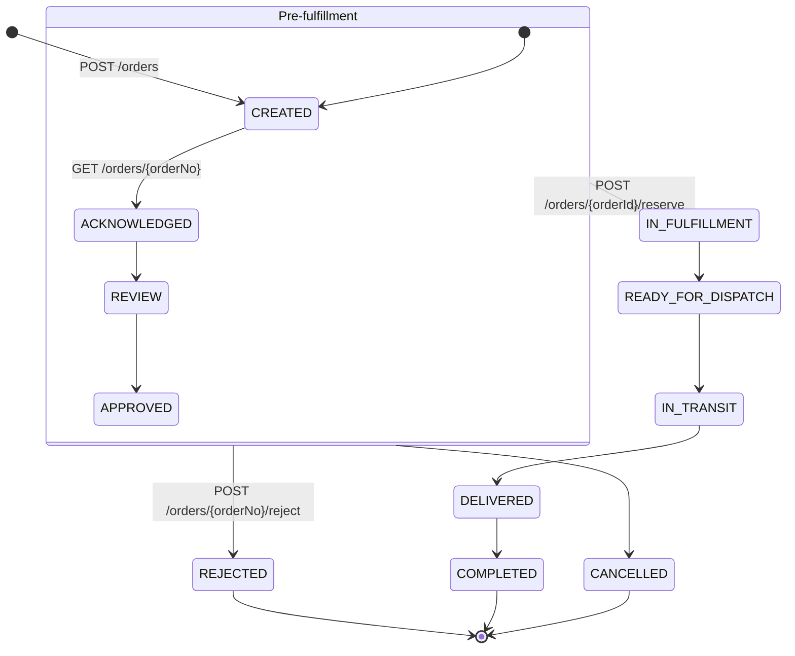
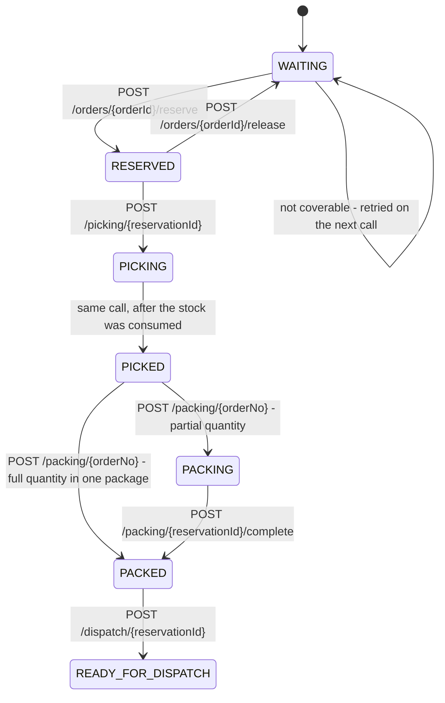
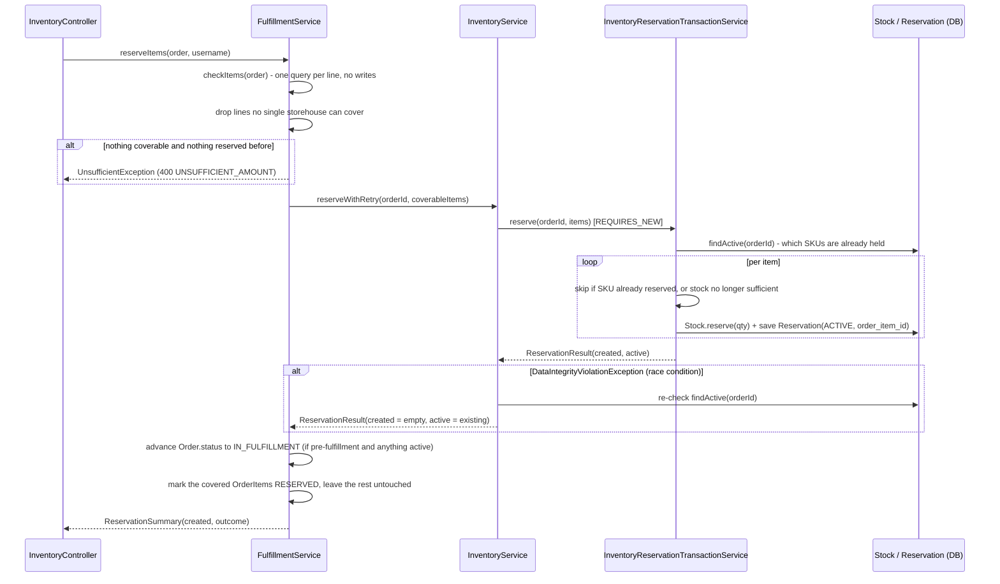
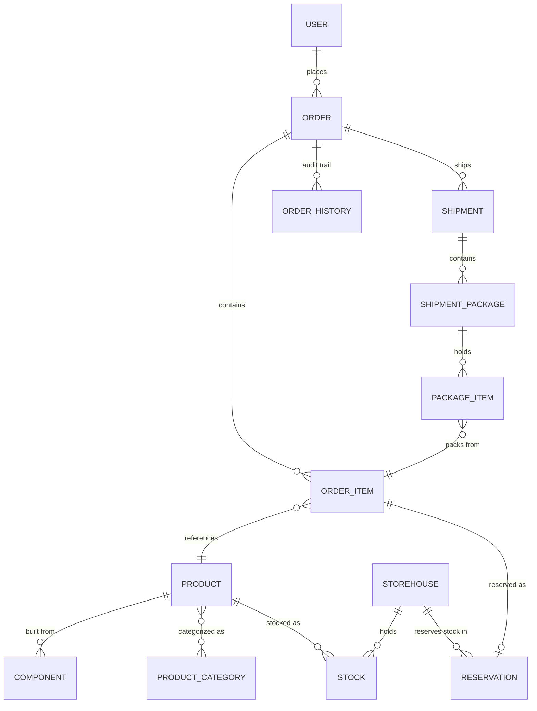

# Supply Chain Management (scm-temporal)

A Spring Boot demo application modeling a simplified supply-chain process: customers place orders,
orders are checked against warehouse stock, inventory is reserved, and the reserved goods are then
picked, packed and made ready for dispatch. It exposes a versioned JSON REST API secured with JWT,
plus a classic server-rendered Thymeleaf site.

> This document covers the **backend/REST API**. The project also ships a Vaadin-based admin UI
> (`src/main/java/com/supplychainmanagement/vaadin`) and a React frontend (`src/main/frontend`),
> both intentionally left out of this document for now.

## Table of contents

- [Order workflow](#order-workflow)
- [Fulfillment workflow](#fulfillment-workflow)
- [Tech stack](#tech-stack)
- [Getting started](#getting-started)
- [Configuration](#configuration)
- [Architecture](#architecture)
- [Domain model](#domain-model)
- [REST API overview](#rest-api-overview)
- [Authentication & authorization](#authentication--authorization)
- [Rate limiting](#rate-limiting)
- [Testing](#testing)
- [Known gaps / work in progress](#known-gaps--work-in-progress)

## Order workflow

Every `Order` moves through a coarse-grained `OrderStatus` state machine. The diagram reflects what
is actually implemented today — including which HTTP calls trigger which transition:



Notes on how this actually behaves in the code (`OrderController`, `InventoryController`,
`FulfillmentServiceImpl`):

- **`CREATED`** is the default status set by `Order`'s `@PrePersist` hook when an order is created.
- **`ACKNOWLEDGED`** is set as a side effect of `GET /orders/{orderNo}` — fetching order details
  acknowledges it. The guard against re-acknowledging is commented out, so it fires on every call.
- **`REVIEW`** and **`APPROVED`** are modeled in the enum but not yet driven by any endpoint.
- **`REJECTED`** can be set from any pre-fulfillment status via `POST /orders/{orderNo}/reject`
  (the only check is that the order isn't already rejected).
- **`IN_FULFILLMENT`** is set by `FulfillmentServiceImpl.reserveItems()` — but **only** when the
  order is currently in one of `CREATED`, `ACKNOWLEDGED`, `REVIEW`, or `APPROVED`
  (`PRE_FULFILLMENT_STATUSES`) **and** at least one line is covered by an active reservation. This
  makes the reserve call idempotent: calling it again on an order that already advanced past this
  point does not regress its status. A *partial* reservation counts — fulfillment has started for at
  least one line.
- **`READY_FOR_DISPATCH` → `IN_TRANSIT` → `DELIVERED` → `COMPLETED`** and **`CANCELLED`** are
  defined in `OrderStatus` but not yet wired up at the *order* level — the per-line equivalent up to
  `READY_FOR_DISPATCH` is implemented, see below and
  [Known gaps](#known-gaps--work-in-progress).
- Every status change goes through `OrderServiceImpl.update()` or `FulfillmentServiceImpl`, both of
  which publish an `OrderStatusChangedEvent`. `OrderStatusChangedListener` picks this up
  `AFTER_COMMIT` and writes an immutable `OrderHistory` audit row (previous status, new status,
  acting user). Any new status-changing code path should follow this same event pattern instead of
  writing history rows inline.
- Two things are load-bearing for that audit trail and easy to break again:
  - The publishing method **must** be `@Transactional`. `@TransactionalEventListener(AFTER_COMMIT)`
    silently discards events published without a transaction — no error, no log line.
  - The listener **must** be `@Transactional(propagation = REQUIRES_NEW)`. An `AFTER_COMMIT`
    callback runs while the original transaction's resources are still bound but the transaction is
    already committed; with the default propagation the repository call joins that finished
    transaction and its `EntityManager` is closed without another flush, so the row is dropped.

## Fulfillment workflow

Independently of the order-level status, each **`OrderItem`** tracks its own, finer-grained
`FulfillmentStatus`. Unlike the order-level chain, this one is implemented end to end:



Which service owns which stretch:

| Stretch | Service | Controller |
|---------|---------|------------|
| `WAITING ⇄ RESERVED` | `FulfillmentService` | `InventoryController` |
| `RESERVED → PICKED` | `OrderHandlingService` | `FulfillmentController` |
| `PICKED → PACKED` | `PackingService` | `FulfillmentController` |
| `PACKED → READY_FOR_DISPATCH` | `OrderHandlingService.readyDispatch()` | `FulfillmentController` |

- **Reservation is partial.** Lines that a single storehouse can cover become `RESERVED`; the rest
  stay `WAITING` and are attempted again on the next reserve call, which skips whatever is already
  held for that order. An order is only rejected outright when *nothing* can be reserved and nothing
  was reserved earlier.
- **Picking is all-or-nothing per line.** `POST /picking/{reservationId}` consumes the reserved
  stock and takes the line `PICKING → PICKED` in one call; there is no partial pick, because the
  quantity was already fixed when the line was reserved.
- **Packing is quantity-aware.** `POST /packing/{orderNo}` builds a `ShipmentPackage` from a list of
  `(orderItemId, qty)` pairs. A line lands in `PACKED` only once the quantities across all packages
  add up to the ordered quantity; until then it sits in `PACKING`. The service refuses to pack more
  than was ordered, counting what previous packages already hold.
- Each of the later transitions validates the status it is coming from and answers **400** with a
  message when the line is not in the expected one — picking a line that is not `RESERVED`, or
  dispatching one that is not `PACKED`, is rejected rather than silently skipped.

### Reservation flow in detail

`reserveItems(order, username)` in `FulfillmentServiceImpl` orchestrates three collaborators:



**The response reports only what this call created.** What an earlier call already reserved is left
out — a repeated call is a no-op and has nothing to show for itself. Since an empty array then has
two possible meanings, `ReservationOutcome` distinguishes them and the controller maps it to the
status code:

| Outcome | Status | Meaning |
|---------|--------|---------|
| `CREATED` | **201** | at least one reservation was newly created |
| `COMPLETE` | **200** | nothing new; every line of the order is reserved or further along |
| `PENDING` | **202** | nothing new, but lines are still `WAITING` — worth calling again later |

`ReservationResult` carries `created` **and** `active` for exactly this reason: the response needs
the first, while the order-status and line-status reconciliation needs the second. A repeat call
after a first one that committed its reservation but failed before the order was written has to be
able to catch the order status up, and it creates nothing to go by.

Two layers guard against creating duplicate reservations for the same order:

1. **Idempotency guard, per SKU** — `InventoryReservationTransactionService.reserve()` loads the
   order's active reservations up front and skips every item whose SKU is already held. That is what
   makes a repeated call continue where the previous one stopped rather than start over, and it also
   covers the case where `checkItems()` picks a different storehouse the second time around.
2. **Race-condition fallback** — a DB unique constraint on `(order_id, sku, storehouse_id)` is the
   last line of defense; `InventoryServiceImpl.reserveWithRetry()` catches
   `DataIntegrityViolationException` and returns the now-existing reservations as `active` with an
   empty `created` — the concurrent call did the inserting, not this one.

An item that cannot be reserved is **skipped, not thrown on** — a single unavailable line must not
roll back the lines that succeeded. `Stock.reserve()` validates before it mutates, so checking
availability up front leaves no half-changed entity behind.

`reserveItems()` and `releaseItems()` are `@Transactional`, so the order status, the line item
statuses and the published event share one commit. The stock side does **not** roll back with them:
`reserve()`/`release()` run `REQUIRES_NEW` and commit on their own. That is deliberate — the
idempotency guard and the retry loop need to see committed state — but it means a failure after the
reservation leaves stock reserved while the order stays untouched. The idempotency guard makes a
repeat call safe.

Releasing (`releaseItems()` / `InventoryReservationTransactionService.release()`) frees the reserved
stock and **deletes** the `Reservation` row (rather than just flipping it to `RELEASED`) — the
unique constraint above would otherwise permanently block re-reserving the same
order/SKU/storehouse combination.

## Tech stack

| Layer          | Technology                                                                  |
|----------------|-----------------------------------------------------------------------------|
| Language       | Java 25                                                                     |
| Framework      | Spring Boot 4.1.0 (Web MVC), Spring Security 7                              |
| Persistence    | Spring Data JPA / Hibernate ORM 7, MariaDB (`hibernate-community-dialects`) |
| JSON           | Jackson 3 (`tools.jackson`) — see the note below                            |
| Auth           | JWT (`jjwt`), BCrypt/Argon2 via BouncyCastle                                 |
| Mapping        | MapStruct, Lombok                                                           |
| Rate limiting  | Bucket4j                                                                    |
| Testing        | JUnit 5, Mockito, AssertJ                                                   |
| Build          | Maven (wrapper included: `mvnw` / `mvnw.cmd`)                               |

> **Jackson 2 and 3 coexist here.** Spring Boot 4.1 auto-configures **Jackson 3**
> (`tools.jackson.databind`), and that is what serializes the API responses — inject
> `tools.jackson.databind.ObjectMapper`, there is no bean for the Jackson 2 one. Jackson 2
> (`com.fasterxml.jackson.databind`) stays on the classpath because `jjwt-jackson` needs it; do not
> remove that dependency. The **annotations** did not move: `@JsonInclude`, `@JsonFormat`,
> `@JsonIgnore` are still `com.fasterxml.jackson.annotation.*` and are honoured by Jackson 3.

`spring-boot-starter-webflux` is still a declared dependency but no longer used by any code — see
[Synchronous by design](#synchronous-by-design).

## Getting started

### Prerequisites

- JDK 25
- A MariaDB instance reachable per `spring.datasource.url` (default: `jdbc:mariadb://h3:3306/scm`)
- Maven (or use the bundled `./mvnw` / `mvnw.cmd` wrapper)

### Build

```bash
mvn -q compile
```

### Run (dev profile)

```bash
mvn -Dspring-boot.run.profiles=dev spring-boot:run
```

The app starts on `server.port` (default `8080`). Logs are written both to stdout and to
`logs/app-<port>.log` (`logging.file.name=logs/app-${server.port}.log` in
`application-dev.properties`) — tail that file to tell `Started Application` from
`APPLICATION FAILED TO START`.

### Run tests

```bash
mvn test
```

## Configuration

Configuration is split across Spring profiles:

- `application.properties` — shared defaults: datasource URL/credentials, JPA dialect
  (`ddl-auto=update`), API versioning defaults, Vaadin URL mapping.
- `application-dev.properties` — dev-only overrides: DevTools hot-reload, JWT secret/expiration,
  file logging.
- `application-prod.properties` — production overrides.
- `application.properties.dist` — a template to copy from for local/untracked overrides.

> The three live `application*.properties` files are **git-ignored**: they hold the datasource
> credentials and `app.jwtSecret`. Start from `application.properties.dist`. A missing
> `app.jwtSecret` fails the context start with `Could not resolve placeholder 'app.jwtSecret'`.

> **Persistence caveat:** `spring.jpa.hibernate.ddl-auto=update` will add missing tables/columns but
> will **not** fix an existing column's type, backfill data, or add/drop constraints. If you change
> an entity's `@Enumerated` mapping or a column's type, the database will silently drift out of sync
> with the entity unless you migrate it manually (verify with `information_schema` /
> `SHOW CREATE TABLE`, don't assume the entity mapping matches what's actually in the DB).
>
> The `reservation.order_item_id` column is the current example: `update` adds the column and then
> fails to add its foreign key, because existing rows carry a value that references nothing. Adding
> a `NOT NULL` column to a populated table leaves MariaDB's default (`0`) behind, and `0` is not a
> valid `order_items.id`. Such a column has to be added nullable, backfilled, and only then
> constrained.

## Architecture

### Two request pipelines, one JWT filter

`SpringSecurityConfig` defines three independently-ordered `SecurityFilterChain` beans, scoped with
`.securityMatcher(...)` so their rules never interact:

1. **`apiFilterChain`** (`/api/**`) — stateless, JWT-authenticated (`JwtAuthenticationFilter` +
   `JwtTokenProvider` + `JwtAuthenticationEntryPoint`), CSRF disabled.
2. **`vaadinFilterChain`** (`/app/**`) — Vaadin's own security configurer (out of scope here).
3. **`webFilterChain`** (everything else) — classic Thymeleaf pages, session-based form login,
   CSRF stays on.

### Native Spring MVC API versioning

Endpoints declare a version directly on the mapping annotation, e.g.
`@GetMapping(path = "/{orderNo}", version = "1.0")` (see `OrderController`, `AuthApiController`'s
two `/login` variants for `1.0`/`2.0`). `WebConfig` configures a custom `useVersionResolver` that
reads the version from the second path segment (`/api/1.0/...` → `"1.0"`). `ApiVersionDefaultFilter`
runs at the highest filter precedence and rewrites any unversioned `/api/...` request to
`/api/{spring.mvc.apiversion.default}/...` (default `1.0`) *before* Spring MVC or Security see it —
so clients may omit the version and still hit versioned endpoints. When adding a new endpoint,
follow the existing pattern: class-level `@RequestMapping({"/api/{version}/..."})`, per-method
`version = "x.y"`.

### Paged list endpoints

Every list endpoint follows the same shape, established by `OrderController.list`: four request
parameters `page` / `size` / `sort` / `order`, assembled into a `PageRequest`, and answered with
`PageResponse.of(page)`:

```json
{ "content": [ ... ], "total": 42, "page": 0, "size": 25 }
```

`total` carries the overall count the frontend dataProvider needs for pagination. Defaults are
`page=0`, `size=25`, `order=ASC`; the default `sort` field differs per endpoint (`id` for orders,
`expiresAt` for the picking list, `sku` for stock).

Note that `sort` is applied as a JPQL path, so only fields resolvable under the query's root alias
work. On a projection query a sort over a joined column (`productName` → `p.name`) will fail.

### Responses are DTOs, not entities

List and detail endpoints answer with records under `dto/`, never with JPA entities. This is not
cosmetic — handing an entity to the response writer breaks in two ways at once:

- **N+1 queries.** `spring.jpa.open-in-view` is left at its default (`true`), so the session is
  still open while the response is written and every LAZY reference resolves silently, one query per
  row and per level.
- **Cycles.** `Reservation → orderItem → order → orderItems → orderItem …` closes on itself, and
  Jackson cannot get out of it.

The picking list is the reference example: `PickingOrderDto` is filled by a constructor projection
in `ReservationRepository.findPickingOrders()`, which is **one query** for the page regardless of
its size, with nothing lazy left in the response. The picking *actions* return the same DTO, mapped
inside `OrderHandlingServiceImpl` while the session is open, so the warehouse gets one row format
everywhere.

A projection query needs an explicit `countQuery` when it joins: the joins are inner joins and can
drop rows, so a plain `count(r)` would report a larger total than the page query can deliver.

### Synchronous by design

All service interfaces are plain synchronous methods. `OrderService`, `ProductService`,
`ComponentService` and `UserService` used to return `Mono`/`Flux` over blocking JPA, wrapped in
`Mono.fromCallable(...).subscribeOn(Schedulers.boundedElastic())`. That combination made
`@Transactional` **ineffective**: the transaction proxy commits when the method returns, and such a
method returns the not-yet-executed `Mono` immediately — the actual database work then ran later, on
a different thread, outside any transaction. Nothing was atomic, `readOnly` had no effect, and
`@TransactionalEventListener(AFTER_COMMIT)` never fired because there was no transaction to commit.

Do not reintroduce reactive return types over JPA here. If a service needs to be async, the
transaction has to live *inside* the callable, on a separate bean — self-invocation goes around the
proxy and changes nothing. `InventoryServiceImpl` → `InventoryReservationTransactionService` is the
existing example of that pattern.

Only commented-out code still mentions `Mono` (`OrderController`, `ComponentController`).

### Service boundaries

The fulfillment chain is split by responsibility rather than by entity:

- **`ProductionService`** — `checkItems()` (read-only availability per line) and `produce()`
  (builds finished products from component stock: picks a storehouse that holds enough of every
  required component, decrements them, and adds the produced unit as new stock).
- **`FulfillmentService`** — getting an order reserved: `reserveItems()` / `releaseItems()`.
- **`OrderHandlingService`** — what the warehouse does with an order that is already reserved:
  the picking list, picking by reservation or by order, and the final `readyDispatch()`.
- **`PackingService`** — building `ShipmentPackage`s out of picked lines and completing them.
- **`LogisticsService`** — declared, not implemented.

### AOP utilities

**`@NoCheck`** (`annotation/NoCheck.java`) + `NoCheckAspect` — a marker annotation currently only
used for `@After` logging via AspectJ; it does not (yet) affect authorization or validation.

## Domain model

Simplified entity relationships:



- **`User`** (`entity/users`) is a single-table-inheritance hierarchy (`Admin`, `Customer`,
  `Distributor`, `Logistics`, `Manager`, `Supplier`, `Warehouse`) discriminated by `user_type`, with
  a many-to-many `Role` relationship (`RoleEnum`: `CUSTOMER`, `MANAGER`, `SUPPLIER`, `WAREHOUSE`,
  `LOGISTICS`, `DISTRIBUTOR`, `ADMIN`).
- **`Order.orderItems`** is a `Set` ordered by `@OrderBy("id")`. It is a Set rather than a List
  because the `@EntityGraph` on `OrderRepository` fetches three collections at once — with two
  `List`s among them Hibernate raises `MultipleBagFetchException`. `Product.components` is the only
  bag left in that graph; adding a second one brings the exception back. The `@OrderBy` is what
  keeps the line items in a stable order, since a Set mapping is otherwise loaded into a
  HashSet-backed collection with arbitrary iteration order.
- **`Product`** has a unique `sku` (`UUID`) and `articleNo` (`Long`), belongs to zero or more
  `ProductCategory`, and is built from one or more `Component`s (weight is auto-computed from
  component weights on persist).
- **`Stock`** tracks `onHand`/`reserved` quantity per `(storehouse, sku)` pair (unique constraint),
  with optimistic locking (`@Version`) and domain methods `reserve()`/`release()`/`consume()` that
  enforce non-negative availability. `available` is derived as `onHand - reserved`.
- **`Reservation`** points at the `OrderItem` it was made for, through a unidirectional, LAZY
  `@OneToOne` on `order_item_id`. It additionally keeps `orderId` (`String`, **not** the numeric
  `Order.id`), `sku` and `quantity` denormalized: `Stock` is keyed by `(sku, storehouse)`, so the
  hot reserve/release path reaches its data without joining through the order item. Unique
  constraint on `(order_id, sku, storehouse_id)`, status `ACTIVE` / `RELEASED` / `CONSUMED`;
  released reservations are deleted rather than kept (see
  [Reservation flow](#reservation-flow-in-detail)).
  - The relation is deliberately **unidirectional** — `OrderItem` does not point back. A back
    reference would drag `Order → orderItems → reservation → orderItem` into every response that
    serializes a reservation.
- **`Shipment` / `ShipmentPackage` / `PackageItem`** model the outbound side: a shipment belongs to
  an order and a customer, holds packages (`PackageType`, dimensions, weight, `PackageStatus`), and
  each package holds `PackageItem`s that reference an `OrderItem` with a packed quantity. Only the
  package and item level is written today — see [Known gaps](#known-gaps--work-in-progress).
- **`OrderHistory`** is an append-only audit trail written by `OrderStatusChangedListener`. Its
  `user_id` is **nullable**: not every status change has an acting user (`reserveItems()` resolves
  one from the login identifier, but `OrderServiceImpl.update(id, order)` has none). A `NOT NULL`
  column here costs the audit row rather than gaining the attribution.

## REST API overview

All endpoints are under `/api/{version}/...` (version can be omitted; see
[versioning](#native-spring-mvc-api-versioning)). Authorization is enforced with
`@PreAuthorize("hasAnyAuthority(...)")` using `RoleEnum` values.

| Resource | Endpoints | Roles |
|----------|-----------|-------|
| Auth | `POST /auth/register`, `POST /auth/login` (`1.0` and `2.0`), `GET /auth/logout` | public |
| Orders | `GET /orders` *(paged)*, `GET /orders/new` *(paged, by status)*, `GET /orders/{orderNo}`, `POST /orders`, `POST /orders/{orderNo}/reject` | ADMIN, MANAGER, CUSTOMER |
| Production | `POST /orders/{orderNo}/check` (availability — read-only), `POST /produce` *(paged)* | ADMIN, MANAGER |
| Inventory | `POST /orders/{orderId}/reserve`, `POST /orders/{orderId}/release` | ADMIN, MANAGER |
| Picking | `GET /picking-orders` *(paged)*, `POST /picking/{reservationId}`, `POST /picking/order/{orderNo}` | ADMIN, WAREHOUSE |
| Packing | `POST /packing/{orderNo}`, `POST /packing/{reservationId}/complete` | ADMIN, WAREHOUSE |
| Dispatch | `POST /dispatch/{reservationId}` | ADMIN, WAREHOUSE |
| Shipments | `GET /packages` *(paged)* | ADMIN, LOGISTICS |
| Products | `GET /products`, `GET /products/{articleNo}`, `GET /products/sku/{sku}`, `POST /products`, `PUT /products/{id}`, `DELETE /products/{id}` | ADMIN, MANAGER |
| Components | `GET /components`, `GET /components/sku/{sku}`, `GET /components/article/{articleNo}`, `POST /components/`, `PUT /components/{id}`, `DELETE /components/{id}` | ADMIN, MANAGER |
| Stock | `POST /stock/add`, `POST /stock/transfer`, `GET /stock/{sku}`, `GET /stock/storehouse/{id}` *(paged)* | ADMIN, WAREHOUSE |
| Users | `GET /users` *(paged)*, `GET /users/{id}`, `POST /users`, `PUT /users/{id}`, `DELETE /users/{id}` | ADMIN, MANAGER |

Notable response-code conventions:

- `POST /orders/{orderId}/reserve` returns **201 / 200 / 202** as described under
  [Reservation flow](#reservation-flow-in-detail), and **400** with
  `errorCode: UNSUFFICIENT_AMOUNT` if nothing could be reserved at all and nothing was reserved
  earlier. The body always lists only what *this* call created — an empty array on a repeat.
- `POST /orders` returns **201 Created**.
- `GET /stock/storehouse/{id}` answers **404** only when the storehouse holds no stock at all;
  a page past the end is an empty page, not an error.
- The picking, packing and dispatch endpoints catch `APIException` and answer with
  `{"message": "..."}` at the exception's own status, rather than letting it reach
  `GlobalExceptionHandler`.
- `GET /products`, `GET /products/{articleNo}` and all `/users` endpoints return DTOs
  (`ProductDto`, `UserDto`), not entities. `/products` hides `id`, `categories` and `components`
  from non-privileged callers; `/users` never exposes the password hash.
- Authorization failures return **403** with `errorCode: WRONG_ROLE`, missing authentication
  **401** with `errorCode: UNAUTHENTICATED`.

## Authentication & authorization

- Login (`AuthApiController` → `AuthService`) issues a JWT (`JwtTokenProvider`) and sets it as a
  cookie (`app.cookie.name`, configurable secure flag).
- `JwtAuthenticationFilter` runs before `UsernamePasswordAuthenticationFilter` on the `/api/**`
  chain and populates the `SecurityContext` from the JWT.
- Authorization on individual endpoints uses method security
  (`@PreAuthorize("hasAnyAuthority('ADMIN', ...)")`) against `RoleEnum` values — there is no global
  role-to-path mapping (the commented-out block in `SpringSecurityConfig` shows an earlier,
  abandoned approach).
- Use **`hasAnyAuthority`**, not `hasAnyRole`. The authorities are prefix-free (`ADMIN`, `MANAGER`,
  …); `hasAnyRole('ADMIN')` checks for `ROLE_ADMIN` and is therefore always false here.
- A denied `@PreAuthorize` throws out of the controller method and never reaches Spring Security's
  `ExceptionTranslationFilter`, so `GlobalExceptionHandler.handleAccessDenied` resolves it in the
  MVC layer: **403 / `WRONG_ROLE`** for an authenticated caller with the wrong role, **401 /
  `UNAUTHENTICATED`** for one with no authentication at all. `RoleService.requireAnyAuthority()`
  throws the same `WrongRoleException` for checks an annotation cannot express.
- The `apiFilterChain` permits only the `ASYNC` and `ERROR` dispatcher types without
  authentication. Adding `REQUEST` there would match *every* call — rules are evaluated in order and
  the first match wins — which silently disables `anyRequest().authenticated()` and everything else
  below it.

## Rate limiting

`RateLimitingFilter` (`service/ratelimiting`) puts each request into a Bucket4j bucket with
per-`PricingPlan` bandwidth (`FREE`, `BASIC`, `PROFESSIONAL` — see
`PricingPlan.resolvePlanFromApiKey()`). The bucket key is the `X-API-KEY` header; without one the
caller falls back to a bucket per remote address, and thus to `PricingPlan.FREE`. A missing key is
not treated as a rate-limit violation.

The filter is deliberately **not** a `@Component` — as a filter bean Spring Boot would register it
for every request, Vaadin UIDL and static resources included, and throttle the whole application.
`RateLimitingConfig` registers it through a `FilterRegistrationBean` scoped to `/api/*`.

> **Heads-up on the FREE plan:** it is defined as `capacity(2)` with `refillGreedy(20, 2 minutes)` —
> a bucket that holds two tokens but is refilled twenty at a time. In practice the third request
> inside the refill window gets a 429. That combination looks like a typo; revisit it before anyone
> relies on these numbers.

## Testing

```bash
mvn test
```

| Test | Covers |
|------|--------|
| `ApplicationTests` | Spring context load — **needs a reachable database and `app.jwtSecret`** |
| `FulfillmentServiceCheckItemsTest` | storehouse selection, that `checkItems` writes nothing and issues one query per line |
| `FulfillmentServiceReserveItemsTest` | partial reservation, continuation on repeat, the `CREATED`/`COMPLETE`/`PENDING` outcomes, that only newly created reservations are reported, that the order item id reaches the `ReserveItem`, user attribution |
| `FulfillmentServiceReleaseItemsTest` | that the status reset happens only after a successful release |
| `GlobalExceptionHandlerTest` | that a `@PreAuthorize` denial routes to the 403 handler and not to the catch-all |
| `UserMapperTest` | that no password hash or internal field reaches the response |
| `ProductMapperTest` | field suppression for non-privileged callers, and that the entity is left unmodified |

Everything except `ApplicationTests` runs without Spring context or database (Mockito + AssertJ), so
the suite finishes in a couple of seconds. To run only the fulfillment ones:

```bash
mvn test -Dtest='Fulfillment*Test'
```

Still uncovered: reservation idempotency and the retry loop at the persistence level, the storehouse
selection inside `produce()`, and everything from picking onwards — `OrderHandlingService` and
`PackingService` have no tests at all, including the quantity arithmetic in `createPackage()`.

## Known gaps / work in progress

- **Order-level statuses stop at `IN_FULFILLMENT`.** `READY_FOR_DISPATCH`, `IN_TRANSIT`,
  `DELIVERED`, `COMPLETED` and `CANCELLED` are defined but nothing advances an *order* into them,
  even once all its lines have reached `READY_FOR_DISPATCH`.
- **`LogisticsService` is an empty interface** (`dispatch()`, `tracking()`), and no `Shipment` is
  ever created — `PackingService.createPackage()` builds `ShipmentPackage`s without attaching them
  to one, so `ShipmentStatus` is currently unreachable.
- **`PackingServiceImpl.packingReservationByIdComplete()` returns `null`** after writing the status,
  so `POST /packing/{reservationId}/complete` answers with an empty body.
- **`ShipmentController` injects `ShipmentPackageRepository` directly**, bypassing the service layer
  every other controller goes through.
- The picking/packing/dispatch write paths are **not `@Transactional`**. Each repository call
  commits on its own, so a failure mid-way leaves the line item in an intermediate status — a pick
  that fails at `consumeWithRetry` leaves it in `PICKING`.
- `GET /orders/{orderNo}` has a side effect (advances status to `ACKNOWLEDGED`) and its guard is
  commented out, so it fires on every call.
- `UserController.create/update` still accept the raw `User` entity as request body. A caller can
  set `roles` through it, and the endpoint is open to `MANAGER` — so a manager can grant themselves
  `ADMIN`. The response side is already covered by `UserDto`; the request side is not.
- `GlobalExceptionHandler` ends in a catch-all `@ExceptionHandler(Exception.class)` that turns every
  unmapped exception into a 500, even one carrying its own status.
- `OrderServiceImpl.randomOrderNo()` draws from only ~9000 numbers and re-checks existence in a
  loop — a TOCTOU race against the insert, and effectively an endless loop once a few thousand
  orders exist.
- `Reservation.expiresAt` is set to `now()` on creation (probably meant to be `now().plus(...)`) and
  is never evaluated; there is no expiry sweep. The picking list nevertheless sorts by it.
- Two order lines referencing the *same* product produce two `ReserveItem`s with the same SKU; the
  second is skipped by the per-SKU guard, so one of the two lines never gets a reservation. Now that
  reservations are keyed to an `OrderItem`, the guard should follow — or equal SKUs should be merged
  into one quantity before reserving.
- `POST /orders/{orderId}/consume` is commented out in `InventoryController`; consumption happens
  only as part of picking.
- `spring-boot-starter-webflux` is still declared in `pom.xml` although no code uses Reactor
  any more.
