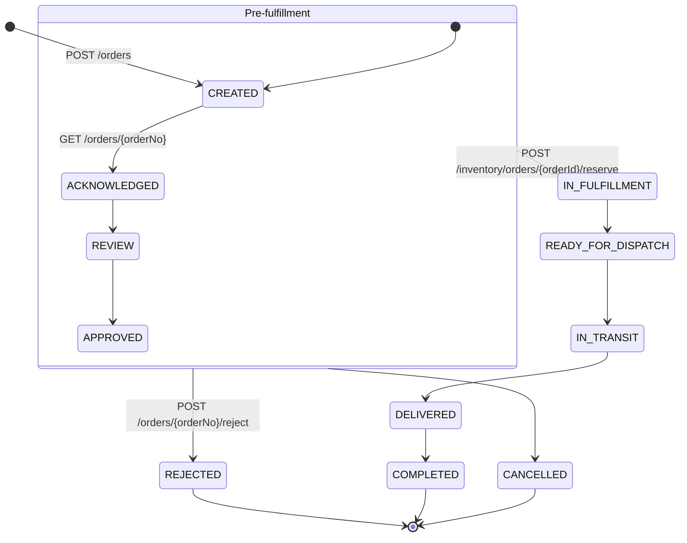
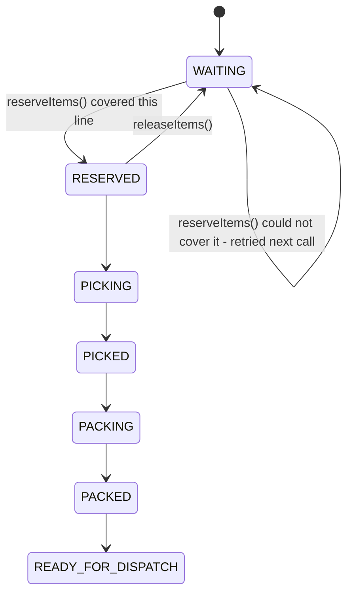
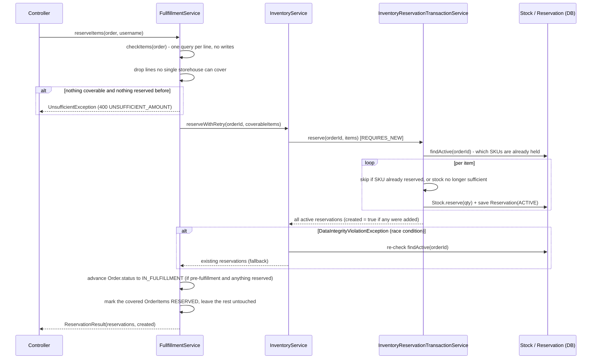
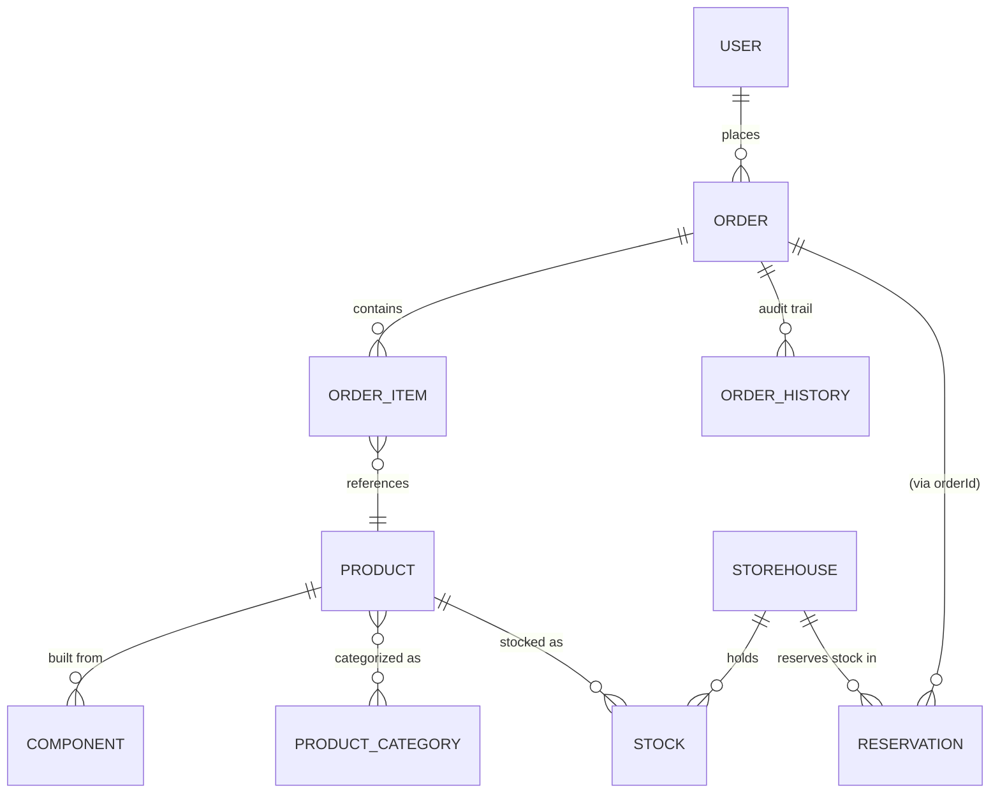

# Supply Chain Management (scm-temporal)

A Spring Boot demo application modeling a simplified supply-chain process: customers place
orders, orders are checked against warehouse stock, inventory is reserved, and (eventually)
picked, packed and dispatched. It exposes a versioned JSON REST API secured with JWT, plus a
classic server-rendered Thymeleaf site.

> This document currently covers the **backend/REST API**. The project also ships a Vaadin-based
> admin UI (`src/main/java/com/supplychainmanagement/vaadin`) which is intentionally left out of
> this document for now.

## Table of contents

- [Order workflow](#order-workflow)
- [Fulfillment workflow](#fulfillment-workflow)
- [Tech stack](#tech-stack)
- [Getting started](#getting-started)
- [Configuration](#configuration)
- [Architecture](#architecture)
- [Domain model](#domain-model)
- [REST API overview](#rest-api-overview)
- [Authentication & authorization](#authentication--authorization)
- [Rate limiting](#rate-limiting)
- [Testing](#testing)
- [Known gaps / work in progress](#known-gaps--work-in-progress)

## Order workflow

Every `Order` moves through a coarse-grained `OrderStatus` state machine. The diagram below
reflects what is actually implemented today — including which HTTP calls trigger which
transition:



Notes on how this actually behaves in the code (`OrderController`, `InventoryController`,
`FullfillmentServiceImpl`):

- **`CREATED`** is the default status set by `Order`'s `@PrePersist` hook when an order is created.
- **`ACKNOWLEDGED`** is set as a side effect of `GET /orders/{orderNo}` — fetching order details
  acknowledges it. There is currently no guard preventing this from firing more than once.
- **`REVIEW`** and **`APPROVED`** are modeled in the enum but not yet driven by any endpoint.
- **`REJECTED`** can be set from any pre-fulfillment status via `POST /orders/{orderNo}/reject`
  (the only check is that the order isn't already rejected).
- **`IN_FULFILLMENT`** is set by `FullfillmentServiceImpl.reserveItems()` — but **only** when the
  order is currently in one of `CREATED`, `ACKNOWLEDGED`, `REVIEW`, or `APPROVED`
  (`PRE_FULFILLMENT_STATUSES`) **and** at least one line was actually reserved. This makes the
  reserve call idempotent: calling it again on an order that already advanced past this point does
  not regress its status. A *partial* reservation counts — fulfillment has started for at least one
  line.
- **`READY_FOR_DISPATCH` → `IN_TRANSIT` → `DELIVERED` → `COMPLETED`** and **`CANCELLED`** are
  defined in `OrderStatus` but not yet wired up to any controller/service logic — see
  [Known gaps](#known-gaps--work-in-progress).
- Every status change goes through `OrderServiceImpl.update()` or `FullfillmentServiceImpl`, both
  of which publish an `OrderStatusChangedEvent`. `OrderStatusChangedListener` picks this up
  `AFTER_COMMIT` and writes an immutable `OrderHistory` audit row (previous status, new status,
  acting user). Any new status-changing code path should follow this same event pattern instead of
  writing history rows inline.
- Two things are load-bearing for that audit trail and easy to break again:
  - The publishing method **must** be `@Transactional`. `@TransactionalEventListener(AFTER_COMMIT)`
    silently discards events published without a transaction — no error, no log line.
  - The listener **must** be `@Transactional(propagation = REQUIRES_NEW)`. An `AFTER_COMMIT`
    callback runs while the original transaction's resources are still bound but the transaction is
    already committed; with the default propagation the repository call joins that finished
    transaction and its `EntityManager` is closed without another flush, so the row is dropped.

## Fulfillment workflow

Independently of the order-level status, each **`OrderItem`** tracks its own, finer-grained
`FullfillmentStatus`:



- `WAITING → RESERVED` and the reverse `RESERVED → WAITING` are the only transitions currently
  implemented, driven by `FullfillmentService.reserveItems()` / `releaseItems()`.
- **Reservation is partial.** Lines that a single storehouse can cover become `RESERVED`; the rest
  stay `WAITING` and are attempted again on the next `reserveItems()` call, which skips whatever is
  already held for that order. An order is only rejected outright when *nothing* can be reserved and
  nothing was reserved earlier.
- `RESERVING` is defined in the enum but currently **never set**. It used to be written by
  `checkItems()`, which was wrong for a read-only availability check. Its natural home is inside
  `reserveItems()`, between the attempt and its confirmation.
- `PICKING` through `READY_FOR_DISPATCH` are modeled but not yet implemented (there is a stub
  `POST /picking/{orderId}` endpoint with no logic behind it yet).

### Reservation flow in detail

`reserveItems(order, username)` in `FullfillmentServiceImpl` orchestrates three collaborators:



Two layers guard against creating duplicate reservations for the same order:

1. **Idempotency guard, per SKU** — `InventoryReservationTransactionService.reserve()` loads the
   order's active reservations up front and skips every item whose SKU is already held. That is what
   makes a repeated call continue where the previous one stopped rather than start over, and it also
   covers the case where `checkItems()` picks a different storehouse the second time around.
2. **Race-condition fallback** — a DB unique constraint on `(order_id, sku, storehouse_id)` is the
   last line of defense; `InventoryServiceImpl.reserveWithRetry()` catches
   `DataIntegrityViolationException` and returns the now-existing reservations instead of failing.

An item that cannot be reserved is **skipped, not thrown on** — a single unavailable line must not
roll back the lines that succeeded. `Stock.reserve()` validates before it mutates, so checking
availability up front leaves no half-changed entity behind.

`reserveItems()` and `releaseItems()` are `@Transactional`, so the order status, the line item
statuses and the published event share one commit. The stock side does **not** roll back with them:
`reserve()`/`release()` run `REQUIRES_NEW` and commit on their own. That is deliberate — the
idempotency guard and the retry loop need to see committed state — but it means a failure after the
reservation leaves stock reserved while the order stays untouched. The idempotency guard makes a
repeat call safe.

Releasing (`releaseItems()` / `InventoryReservationTransactionService.release()`) frees the
reserved stock and **deletes** the `Reservation` row (rather than just flipping it to `RELEASED`) —
the unique constraint above would otherwise permanently block re-reserving the same
order/SKU/storehouse combination.

## Tech stack

| Layer          | Technology                                                             |
|----------------|-------------------------------------------------------------------------|
| Language       | Java 25                                                                  |
| Framework      | Spring Boot 4.1.0 (Web MVC), Spring Security 7                          |
| Persistence    | Spring Data JPA / Hibernate ORM, MariaDB (`hibernate-community-dialects`) |
| JSON           | Jackson 3 (`tools.jackson`) — see the note below                         |
| Auth           | JWT (`jjwt`), BCrypt/Argon2 via BouncyCastle                             |
| Mapping        | MapStruct, Lombok                                                        |
| Rate limiting  | Bucket4j                                                                 |
| Testing        | JUnit 5, Mockito, AssertJ                                                |
| Build          | Maven (wrapper included: `mvnw` / `mvnw.cmd`)                            |

> **Jackson 2 and 3 coexist here.** Spring Boot 4.1 auto-configures **Jackson 3**
> (`tools.jackson.databind`), and that is what serializes the API responses — inject
> `tools.jackson.databind.ObjectMapper`, there is no bean for the Jackson 2 one. Jackson 2
> (`com.fasterxml.jackson.databind`) stays on the classpath because `jjwt-jackson` needs it; do not
> remove that dependency. The **annotations** did not move: `@JsonInclude`, `@JsonFormat`,
> `@JsonIgnore` are still `com.fasterxml.jackson.annotation.*` and are honoured by Jackson 3.

`spring-boot-starter-webflux` is still a declared dependency but no longer used by any code — see
[Synchronous by design](#synchronous-by-design).

## Getting started

### Prerequisites

- JDK 25
- A MariaDB instance reachable per `spring.datasource.url` (default: `jdbc:mariadb://h3:3306/scm`)
- Maven (or use the bundled `./mvnw` / `mvnw.cmd` wrapper)

### Build

```bash
mvn -q compile
```

### Run (dev profile)

```bash
mvn -Dspring-boot.run.profiles=dev spring-boot:run
```

The app starts on `server.port` (default `8080`). Logs are written both to stdout and to
`logs/app-<port>.log` (`logging.file.name=logs/app-${server.port}.log` in
`application-dev.properties`).

### Run tests

```bash
mvn test
```

## Configuration

Configuration is split across Spring profiles:

- `application.properties` — shared defaults: datasource URL/credentials, JPA dialect
  (`ddl-auto=update`), API versioning defaults, Vaadin URL mapping.
- `application-dev.properties` — dev-only overrides: DevTools hot-reload, JWT secret/expiration,
  file logging.
- `application-prod.properties` — production overrides.
- `application.properties.dist` — a template to copy from for local/untracked overrides.

> The three live `application*.properties` files are **git-ignored**: they hold the datasource
> credentials and `app.jwtSecret`. Start from `application.properties.dist`.

> **Persistence caveat:** `spring.jpa.hibernate.ddl-auto=update` will add missing tables/columns
> but will **not** fix an existing column's type or add/drop constraints. If you change an
> entity's `@Enumerated` mapping or a column's type, the database will silently drift out of sync
> with the entity unless you migrate it manually (verify with `information_schema` /
> `SHOW CREATE TABLE`, don't assume the entity mapping matches what's actually in the DB).

## Architecture

### Two request pipelines, one JWT filter

`SpringSecurityConfig` defines three independently-ordered `SecurityFilterChain` beans, scoped
with `.securityMatcher(...)` so their rules never interact:

1. **`apiFilterChain`** (`/api/**`) — stateless, JWT-authenticated (`JwtAuthenticationFilter` +
   `JwtTokenProvider` + `JwtAuthenticationEntryPoint`), CSRF disabled.
2. **`vaadinFilterChain`** (`/app/**`) — Vaadin's own security configurer (out of scope here).
3. **`webFilterChain`** (everything else) — classic Thymeleaf pages, session-based form login,
   CSRF stays on.

### Native Spring MVC API versioning

Endpoints declare a version directly on the mapping annotation, e.g.
`@GetMapping(path = "/{orderNo}", version = "1.0")` (see `OrderController`,
`AuthApiController`'s two `/login` variants for `1.0`/`2.0`). `WebConfig` configures a custom
`useVersionResolver` that reads the version from the second path segment
(`/api/1.0/...` → `"1.0"`). `ApiVersionDefaultFilter` runs at the highest filter precedence and
rewrites any unversioned `/api/...` request to `/api/{spring.mvc.apiversion.default}/...` (default
`1.0`) *before* Spring MVC or Security see it — so clients may omit the version and still hit
versioned endpoints. When adding a new endpoint, follow the existing pattern: class-level
`@RequestMapping({"/api/{version}/..."})`, per-method `version = "x.y"`.

### Synchronous by design

All service interfaces are plain synchronous methods. `OrderService`, `ProductService`,
`ComponentService` and `UserService` used to return `Mono`/`Flux` over blocking JPA, wrapped in
`Mono.fromCallable(...).subscribeOn(Schedulers.boundedElastic())`. That combination made
`@Transactional` **ineffective**: the transaction proxy commits when the method returns, and such a
method returns the not-yet-executed `Mono` immediately — the actual database work then ran later, on
a different thread, outside any transaction. Nothing was atomic, `readOnly` had no effect, and
`@TransactionalEventListener(AFTER_COMMIT)` never fired because there was no transaction to commit.

Do not reintroduce reactive return types over JPA here. If a service needs to be async, the
transaction has to live *inside* the callable, on a separate bean — self-invocation goes around the
proxy and changes nothing. `InventoryServiceImpl` → `InventoryReservationTransactionService` is the
existing example of that pattern.

Only commented-out code still mentions `Mono` (`OrderController`, `ComponentController`).

### Business/AOP utilities

- **`service/business/AutomaticConstructionService`** and `FullfillmentServiceImpl.produce()` —
  builds finished products from component stock: picks a storehouse that holds enough of every
  required component, decrements them, and adds the produced unit as new stock.
- **`@NoCheck`** (`annotation/NoCheck.java`) + `NoCheckAspect` — a marker annotation currently only
  used for `@After` logging via AspectJ; it does not (yet) affect authorization or validation.

## Domain model

Simplified entity relationships:



- **`User`** (`entity/users`) is a single-table-inheritance hierarchy (`Admin`, `Customer`,
  `Distributor`, `Logistics`, `Manager`, `Supplier`, `Warehouse`) discriminated by `user_type`, with
  a many-to-many `Role` relationship (`RoleEnum`: `CUSTOMER`, `MANAGER`, `SUPPLIER`, `WAREHOUSE`,
  `LOGISTICS`, `DISTRIBUTOR`, `ADMIN`).
- **`Product`** has a unique `sku` (`UUID`) and `articleNo` (`Long`), belongs to zero or more
  `ProductCategory`, and is built from one or more `Component`s (weight is auto-computed from
  component weights on persist).
- **`Stock`** tracks `onHand`/`reserved` quantity per `(storehouse, sku)` pair (unique constraint),
  with optimistic locking (`@Version`) and domain methods `reserve()`/`release()`/`consume()` that
  enforce non-negative availability.
- **`Reservation`** links an `orderId` (`String`, **not** the numeric `Order.id`) to a `sku`,
  `quantity` and `storehouse`, with a unique constraint on `(order_id, sku, storehouse_id)` and a
  `ReservationStatus` (`ACTIVE`, `RELEASED`, `CONSUMED`). Released reservations are deleted rather
  than kept (see [Reservation flow](#reservation-flow-in-detail)).
- **`OrderHistory`** is an append-only audit trail written by `OrderStatusChangedListener`. Its
  `user_id` is **nullable**: not every status change has an acting user (`reserveItems()` resolves
  one from the login identifier, but `OrderServiceImpl.update(id, order)` has none). A `NOT NULL`
  column here costs the audit row rather than gaining the attribution.

## REST API overview

All endpoints are under `/api/{version}/...` (version can be omitted; see
[versioning](#native-spring-mvc-api-versioning)). Authorization is enforced with
`@PreAuthorize("hasAnyAuthority(...)")` using `RoleEnum` values.

| Resource     | Endpoints                                                                                   |
|--------------|-----------------------------------------------------------------------------------------------|
| Auth         | `POST /auth/register`, `POST /auth/login` (`1.0` and `2.0` variants), `GET /auth/logout`      |
| Orders       | `GET /orders`, `GET /orders/new` (by status), `GET /orders/{orderNo}`, `POST /orders`, `POST /orders/{orderNo}/reject` |
| Fulfillment  | `POST /orders/{orderNo}/check` (availability check — read-only, reserves and writes nothing), `POST /produce` |
| Inventory    | `POST /orders/{orderId}/reserve`, `POST /orders/{orderId}/release`, `POST /orders/{orderId}/consume`, `POST /picking/{orderId}` (stub, not implemented) |
| Products     | `GET /products`, `GET /products/{articleNo}`, `POST /products`, `PUT /products/{id}`, `DELETE /products/{id}` |
| Components   | `GET /components`, `GET /components/sku/{sku}`, `GET /components/article/{articleNo}`, `POST /components/`, `PUT /components/{id}`, `DELETE /components/{id}` |
| Stock        | `POST /stock/add`, `POST /stock/transfer`, `GET /stock/{sku}`                                 |

Notable response-code conventions:

- `POST /orders/{orderId}/reserve` returns **201 Created** if at least one new reservation was
  made, **200 OK** if only already-active reservations were returned (idempotent replay), and
  **400 Bad Request** with `errorCode: UNSUFFICIENT_AMOUNT` if nothing could be reserved at all.
  A *partial* reservation is a success, not an error — the response lists what is held, and the
  uncovered lines stay `WAITING` for the next call.
- `POST /orders` returns **201 Created**.
- `GET /products`, `GET /products/{articleNo}` and all `/users` endpoints return DTOs
  (`ProductDto`, `UserDto`), not entities. `/products` hides `id`, `categories` and `components`
  from non-privileged callers; `/users` never exposes the password hash.
- Authorization failures return **403** with `errorCode: WRONG_ROLE`, missing authentication
  **401** with `errorCode: UNAUTHENTICATED`.

## Authentication & authorization

- Login (`AuthApiController` → `AuthService`) issues a JWT (`JwtTokenProvider`) and sets it as a
  cookie (`app.cookie.name`, configurable secure flag).
- `JwtAuthenticationFilter` runs before `UsernamePasswordAuthenticationFilter` on the `/api/**`
  chain and populates the `SecurityContext` from the JWT.
- Authorization on individual endpoints uses method security
  (`@PreAuthorize("hasAnyAuthority('ADMIN', ...)")`) against `RoleEnum` values — there is no global
  role-to-path mapping (the commented-out block in `SpringSecurityConfig` shows an earlier,
  abandoned approach).
- Use **`hasAnyAuthority`**, not `hasAnyRole`. The authorities are prefix-free (`ADMIN`, `MANAGER`,
  …); `hasAnyRole('ADMIN')` checks for `ROLE_ADMIN` and is therefore always false here.
- A denied `@PreAuthorize` throws out of the controller method and never reaches Spring Security's
  `ExceptionTranslationFilter`, so `GlobalExceptionHandler.handleAccessDenied` resolves it in the
  MVC layer: **403 / `WRONG_ROLE`** for an authenticated caller with the wrong role, **401 /
  `UNAUTHENTICATED`** for one with no authentication at all. `RoleService.requireAnyAuthority()`
  throws the same `WrongRoleException` for checks an annotation cannot express.
- The `apiFilterChain` permits only the `ASYNC` and `ERROR` dispatcher types without
  authentication. Adding `REQUEST` there would match *every* call — rules are evaluated in order and
  the first match wins — which silently disables `anyRequest().authenticated()` and everything else
  below it.

## Rate limiting

`RateLimitingFilter` (`service/ratelimiting`) puts each request into a Bucket4j bucket with
per-`PricingPlan` bandwidth (`FREE`, `BASIC`, `PROFESSIONAL` — see
`PricingPlan.resolvePlanFromApiKey()`). The bucket key is the `X-API-KEY` header; without one the
caller falls back to a bucket per remote address, and thus to `PricingPlan.FREE`. A missing key is
not treated as a rate-limit violation.

The filter is deliberately **not** a `@Component` — as a filter bean Spring Boot would register it
for every request, Vaadin UIDL and static resources included, and throttle the whole application.
`RateLimitingConfig` registers it through a `FilterRegistrationBean` scoped to `/api/*`.

> **Heads-up on the FREE plan:** it is defined as `capacity(2)` with `refillGreedy(20, 2 minutes)` —
> a bucket that holds two tokens but is refilled twenty at a time. In practice the third request
> inside the refill window gets a 429. That combination looks like a typo; revisit it before anyone
> relies on these numbers.

## Testing

```bash
mvn test
```

| Test | Covers |
|------|--------|
| `ApplicationTests` | Spring context load — **needs a reachable database** |
| `FullfillmentServiceCheckItemsTest` | storehouse selection, that `checkItems` writes nothing and issues one query per line |
| `FullfillmentServiceReserveItemsTest` | partial reservation, continuation on repeat, idempotency, user attribution |
| `FullfillmentServiceReleaseItemsTest` | that the status reset happens only after a successful release |
| `GlobalExceptionHandlerTest` | that a `@PreAuthorize` denial routes to the 403 handler and not to the catch-all |
| `UserMapperTest` | that no password hash or internal field reaches the response |
| `ProductMapperTest` | field suppression for non-privileged callers, and that the entity is left unmodified |

Everything except `ApplicationTests` runs without Spring context or database (Mockito + AssertJ), so
the suite finishes in a couple of seconds. To run only those:

```bash
mvn test -Dtest='*Test' -Dsurefire.failIfNoSpecifiedTests=false
```

Still uncovered: reservation idempotency and the retry loop at the persistence level, and the
storehouse selection inside `produce()`.

## Known gaps / work in progress

- `OrderStatus.READY_FOR_DISPATCH`, `IN_TRANSIT`, `DELIVERED`, `COMPLETED`, and `CANCELLED` are
  defined but not driven by any endpoint or service logic yet.
- `FullfillmentStatus.PICKING` through `READY_FOR_DISPATCH` are defined but not implemented; the
  `POST /picking/{orderId}` endpoint is a stub.
- `GET /orders/{orderNo}` has a side effect (advances status to `ACKNOWLEDGED`), and its guard is
  disabled by a literal `&& false`, so it fires on every call.
- `UserController.create/update` still accept the raw `User` entity as request body. A caller can
  set `roles` through it, and the endpoint is open to `MANAGER` — so a manager can grant themselves
  `ADMIN`. The response side is already covered by `UserDto`; the request side is not.
- `GlobalExceptionHandler` ends in a catch-all `@ExceptionHandler(Exception.class)` that turns every
  unmapped exception into a 500, even one carrying its own status.
- `OrderServiceImpl.randomOrderNo()` draws from only ~9000 numbers and re-checks existence in a
  loop — a TOCTOU race against the insert, and effectively an endless loop once a few thousand
  orders exist.
- `Reservation.expiresAt` is set to `now()` on creation (probably meant to be `now().plus(...)`) and
  is never evaluated; there is no expiry sweep.
- Two orders lines referencing the *same* product produce two `ReserveItem`s with the same SKU; the
  second is skipped by the per-SKU guard. Equal SKUs should be merged into one quantity before
  reserving.
