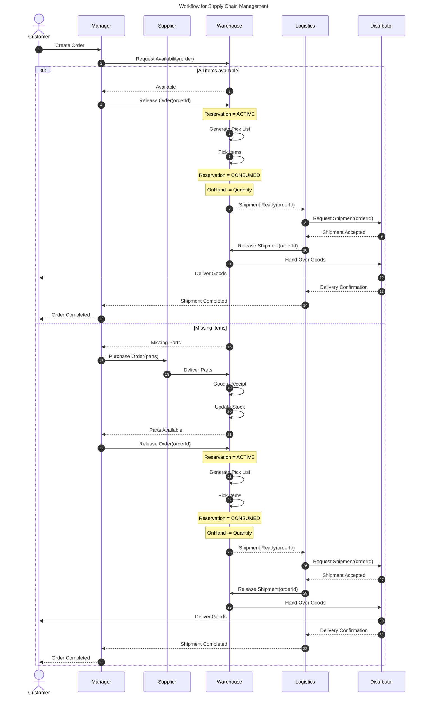

```mermaid
---
title: Workflow for Supply Chain Management
---
sequenceDiagram
autonumber
actor Customer
participant Manager
participant Supplier
participant Warehouse
participant Logistics
participant Distributor
Customer->>Manager: Create Order

    Manager->>Warehouse: Request Availability(order)
    alt All items available

        Warehouse-->>Manager: Available
        Manager->>Warehouse: Release Order(orderId)
        Note over Warehouse: Reservation = ACTIVE
        Warehouse->>Warehouse: Generate Pick List
        Warehouse->>Warehouse: Pick Items
        Note over Warehouse: Reservation = CONSUMED
        Note over Warehouse: OnHand -= Quantity
        Warehouse-->>Logistics: Shipment Ready(orderId)
        Logistics->>Distributor: Request Shipment(orderId)
        Distributor-->>Logistics: Shipment Accepted
        Logistics->>Warehouse: Release Shipment(orderId)
        Warehouse->>Distributor: Hand Over Goods
        Distributor->>Customer: Deliver Goods
        Distributor-->>Logistics: Delivery Confirmation
        Logistics-->>Manager: Shipment Completed
        Manager-->>Customer: Order Completed

    else Missing items

        Warehouse-->>Manager: Missing Parts
        Manager->>Supplier: Purchase Order(parts)
        Supplier->>Warehouse: Deliver Parts
        Warehouse->>Warehouse: Goods Receipt
        Warehouse->>Warehouse: Update Stock
        Warehouse-->>Manager: Parts Available
        Manager->>Warehouse: Release Order(orderId)
        Note over Warehouse: Reservation = ACTIVE
        Warehouse->>Warehouse: Generate Pick List
        Warehouse->>Warehouse: Pick Items
        Note over Warehouse: Reservation = CONSUMED
        Note over Warehouse: OnHand -= Quantity
        Warehouse-->>Logistics: Shipment Ready(orderId)
        Logistics->>Distributor: Request Shipment(orderId)
        Distributor-->>Logistics: Shipment Accepted
        Logistics->>Warehouse: Release Shipment(orderId)
        Warehouse->>Distributor: Hand Over Goods
        Distributor->>Customer: Deliver Goods
        Distributor-->>Logistics: Delivery Confirmation
        Logistics-->>Manager: Shipment Completed
        Manager-->>Customer: Order Completed

    end
```