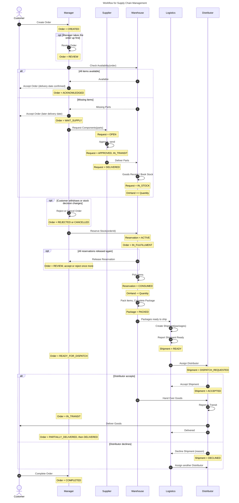

```mermaid
---
title: Workflow for Supply Chain Management
---
sequenceDiagram
autonumber
actor Customer
participant Manager
participant Supplier
participant Warehouse
participant Logistics
participant Distributor
Customer->>Manager: Create Order
Note over Manager: Order = CREATED

    opt Manager takes the order up first
        Manager->>Manager: Review Order
        Note over Manager: Order = REVIEW
    end

    Manager->>Warehouse: Check Availability(order)
    alt All items available
        Warehouse-->>Manager: Available
        Manager-->>Customer: Accept Order (delivery date confirmed)
        Note over Manager: Order = ACKNOWLEDGED

    else Missing items
        Warehouse-->>Manager: Missing Parts
        Manager-->>Customer: Accept Order (later delivery date)
        Note over Manager: Order = WAIT_SUPPLY
        Manager->>Supplier: Request Components(parts)
        Note over Supplier: Request = OPEN
        Supplier->>Supplier: Approve, send
        Note over Supplier: Request = APPROVED, IN_TRANSIT
        Supplier-->>Warehouse: Deliver Parts
        Note over Supplier: Request = DELIVERED
        Warehouse->>Warehouse: Goods Receipt / Book Stock
        Note over Warehouse: Request = IN_STOCK
        Note over Warehouse: OnHand += Quantity
    end

    opt Customer withdraws or stock decision changes
        Manager->>Manager: Reject or Cancel Order
        Note over Manager: Order = REJECTED or CANCELLED
    end

    Manager->>Warehouse: Reserve Stock(orderId)
    Note over Warehouse: Reservation = ACTIVE
    Note over Warehouse: Order = IN_FULFILLMENT

    opt All reservations released again
        Warehouse-->>Manager: Release Reservation
        Note over Manager: Order = REVIEW, accept or reject once more
    end

    Warehouse->>Warehouse: Pick Items
    Note over Warehouse: Reservation = CONSUMED
    Note over Warehouse: OnHand -= Quantity
    Warehouse->>Warehouse: Pack Items, Complete Package
    Note over Warehouse: Package = PACKED
    Warehouse-->>Logistics: Packages ready to ship

    Logistics->>Logistics: Create Shipment(packages)
    Logistics->>Logistics: Report Shipment Ready
    Note over Logistics: Shipment = READY
    Note over Manager: Order = READY_FOR_DISPATCH
    Logistics->>Distributor: Assign Distributor
    Note over Distributor: Shipment = DISPATCH_REQUESTED

    alt Distributor accepts
        Distributor-->>Logistics: Accept Shipment
        Note over Distributor: Shipment = ACCEPTED
        Warehouse->>Distributor: Hand Over Goods
        Distributor->>Distributor: Report In Transit
        Note over Manager: Order = IN_TRANSIT
        Distributor->>Customer: Deliver Goods
        Distributor-->>Logistics: Delivered
        Note over Manager: Order = PARTIALLY_DELIVERED, then DELIVERED
    else Distributor declines
        Distributor-->>Logistics: Decline Shipment (reason)
        Note over Distributor: Shipment = DECLINED
        Logistics->>Distributor: Assign another Distributor
    end

    Customer->>Manager: Complete Order
    Note over Manager: Order = COMPLETED
```
